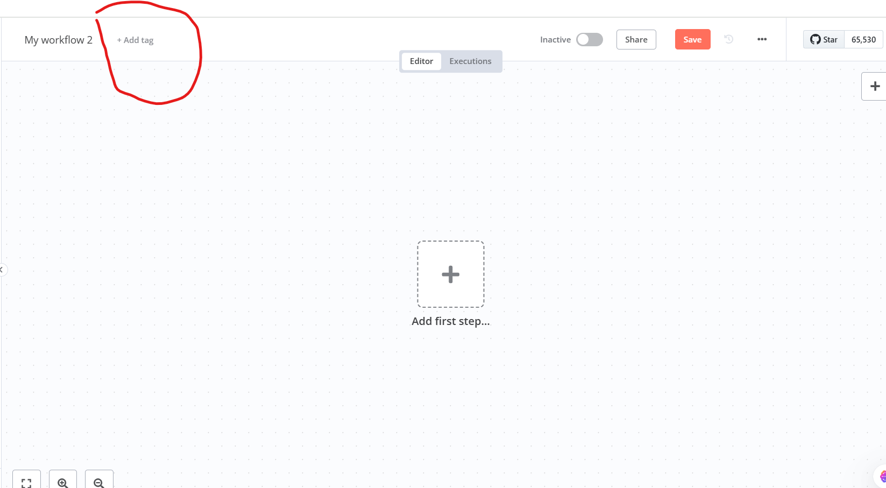

Let’s break down the "Add Tag" feature in n8n that you’ve highlighted in the image. Since you’re a beginner, I’ll explain this in a simple way, with examples, and show how it can be used in real-world scenarios. I’ll also tie this back to the concept of triggers we discussed earlier to give you a fuller picture of how it fits into n8n workflows.

---

### What is "Add Tag" in n8n?

The "Add Tag" button you’ve highlighted in the image is a feature in n8n that allows you to label or categorize your workflows. Think of tags like sticky notes or labels you put on folders to organize them. In n8n, tags help you organize your workflows so you can easily find, filter, or group them later, especially if you have many workflows.

- **Where it is**: The "Add Tag" button is located at the top of the n8n editor interface, next to the workflow name ("My workflow 2" in your image).
- **What it does**: When you click "Add Tag," you can type in a tag (a word or short phrase) to label your workflow. You can add multiple tags to a single workflow.

---

### Why Use Tags in n8n?

Tags are all about **organization** and **efficiency**. As you create more workflows in n8n, it can get tricky to keep track of them. Tags help you:
1. **Group Similar Workflows**: If you have workflows for different purposes (e.g., marketing, customer support, or finance), you can tag them accordingly.
2. **Find Workflows Quickly**: You can filter workflows by tags in the n8n dashboard to locate the one you need.
3. **Collaborate with a Team**: If you’re working with others, tags make it easier for everyone to understand the purpose of a workflow.

---

### How to Add a Tag in n8n

Here’s a step-by-step guide for a beginner:

1. **Open Your Workflow**: You’re already in the editor for "My workflow 2," as shown in your image.
2. **Click "Add Tag"**: Click the "+ Add tag" button next to the workflow name.
3. **Type the Tag**: A small text box will appear. Type a word or phrase, like "Marketing" or "Daily Tasks."
4. **Save the Tag**: Press Enter or click outside the text box to save the tag. It will now appear next to the workflow name.
5. **Add More Tags (Optional)**: You can repeat the process to add more tags if needed.

For example, if "My workflow 2" is a workflow that sends daily sales reports, you might add tags like:
- "Sales"
- "Daily"
- "Reports"

Now, when you go to the n8n dashboard (where all your workflows are listed), you can filter by these tags to find this workflow quickly.

---

### How Tags Work with Triggers

Let’s connect this back to the triggers we discussed in your first image. Triggers are the starting points of your workflows, and tags help you organize workflows based on their triggers or purposes. For example:

- **Scenario**: You have several workflows in n8n:
  - Workflow 1: Uses an "On a Schedule" trigger to send a daily sales report.
  - Workflow 2: Uses an "On Webhook Call" trigger to process new customer orders.
  - Workflow 3: Uses an "On Chat Message" trigger to respond to Slack messages.

- **Using Tags**:
  - Tag Workflow 1 with "Daily" and "Sales."
  - Tag Workflow 2 with "Orders" and "Webhook."
  - Tag Workflow 3 with "Chat" and "Support."

Now, if you want to see all workflows related to "Sales," you can filter by the "Sales" tag in the n8n dashboard, and Workflow 1 will show up. If you want to see all workflows that handle chat messages, filter by "Chat," and Workflow 3 will appear.

---

### Example of Using Tags in n8n

Let’s walk through a simple example:

1. **Create Workflows**:
   - Workflow 1: A workflow that uses the "On Form Submission" trigger to collect customer feedback and save it to Google Sheets.
   - Workflow 2: A workflow that uses the "On a Schedule" trigger to email you a reminder every Monday to follow up with customers.

2. **Add Tags**:
   - For Workflow 1, add tags: "Feedback" and "Forms."
   - For Workflow 2, add tags: "Reminders" and "Weekly."

3. **Use Tags to Organize**:
   - Later, when you have 20 workflows, you can go to the n8n dashboard and filter by "Feedback" to quickly find Workflow 1, or filter by "Weekly" to find Workflow 2.

---

### Real-World Use Case of Tags in n8n

Let’s imagine you’re running a small online business, and you’re using n8n to automate various tasks. You might have workflows for:
- Processing orders.
- Sending marketing emails.
- Handling customer support.
- Generating weekly reports.

Here’s how tags can help:

- **Tagging Workflows**:
  - Order processing workflows: Tag with "Orders" and "E-commerce."
  - Marketing email workflows: Tag with "Marketing" and "Emails."
  - Customer support workflows: Tag with "Support" and "Chat."
  - Weekly reports workflows: Tag with "Reports" and "Weekly."

- **Real-World Benefit**:
  - **For You**: If you need to update all your marketing workflows (e.g., to change the email template), you can filter by the "Marketing" tag to see all relevant workflows at once.
  - **For Your Team**: If you hire a customer support specialist, they can filter by the "Support" tag to see only the workflows they need to work with, without getting overwhelmed by unrelated ones.
  - **For Troubleshooting**: If something goes wrong with your weekly reports, you can filter by "Reports" to quickly find and fix the issue.

---

### A Practical Example Combining Triggers and Tags

Let’s put it all together with a real-world scenario for your online business:

1. **Workflow Setup**:
   - **Workflow 1: Order Confirmation** - Trigger: "On Webhook Call" (when a customer places an order on your website). This workflow sends a confirmation email to the customer.
     - Tags: "Orders," "E-commerce."
   - **Workflow 2: Customer Feedback** - Trigger: "On Form Submission" (when a customer submits a feedback form). This workflow saves the feedback to a Google Sheet.
     - Tags: "Feedback," "Forms."
   - **Workflow 3: Weekly Sales Report** - Trigger: "On a Schedule" (every Monday at 9 AM). This workflow generates a sales report and emails it to you.
     - Tags: "Reports," "Weekly."

2. **Using Tags**:
   - One day, you decide to improve your customer feedback system. You go to the n8n dashboard, filter by the "Feedback" tag, and quickly find Workflow 2 to make changes.
   - Another day, your sales team asks for a list of all workflows related to orders. You filter by the "Orders" tag, and Workflow 1 shows up.

---

### Tips for Beginners Using Tags in n8n

1. **Keep Tags Simple**: Use short, clear words like "Sales," "Marketing," or "Daily." Avoid overcomplicating with long phrases.
2. **Be Consistent**: If you tag one workflow as "Emails," don’t tag another as "Email"—stick to one style for easier filtering.
3. **Use Multiple Tags**: A workflow can have more than one tag. For example, a workflow that sends marketing emails every week could be tagged "Marketing" and "Weekly."
4. **Review Tags Regularly**: As your business grows, you might need to update or reorganize your tags to keep things manageable.

---

### Why Tags Are Useful for Beginners

As a beginner, you might only have a few workflows now, so you might think, "Why bother with tags?" But as you create more workflows, tags will save you a lot of time and frustration. They’re like labels on a filing cabinet—without them, you’d have to open every drawer to find what you need. With tags, you can go straight to the right drawer.

---

Does this explanation of the "Add Tag" feature make sense? If you’d like to dive deeper into any part of this or explore a specific example further, let me know! I can also help with setting up a sample workflow in n8n if you’d like to try it out. 😊

---

# chatgpt response:
The **"Add tag"** option in n8n allows you to assign tags to your workflows for better **organization and categorization**.  

### 🔹 **Why Use Tags in n8n?**  
- **Easier workflow management** – Helps you group related workflows.  
- **Faster searching** – You can filter workflows by tags.  
- **Better organization** – Useful when managing multiple workflows in larger projects.  

### 🔹 **How to Use It?**  
1. Click on **"+ Add tag"** (highlighted in your image).  
2. Type the name of a tag (e.g., **"CRM", "E-commerce", "AI Automation"**).  
3. Press **Enter** to save the tag.  
4. You can add multiple tags to a single workflow.  

Later, when you have multiple workflows, you can **search or filter** them using these tags in the **workflow list view**. 🚀

### 📌 **Real-World Scenario for Using Tags in n8n**  

#### **Scenario: Managing Multiple Automations in an Agency**  
Let's say you run an automation agency (**iAxionix**) and you are working on multiple client projects. You have different workflows for different use cases, such as:  

1️⃣ **E-commerce Automations**  
   - Syncing new Shopify orders with Google Sheets  
   - Sending abandoned cart reminders via email  

2️⃣ **Real Estate Automations**  
   - Notifying agents when a new lead is added in a CRM  
   - Automatically posting new property listings to social media  

3️⃣ **Internal Operations**  
   - Sending daily Slack reminders to your team  
   - Generating and sending invoices automatically  

### 🎯 **How Tags Help in This Case?**  
Instead of searching through a long list of workflows, you can **assign tags** to categorize them.  

✅ **Tag Example:**  
- Workflows related to **Shopify** → `E-commerce`  
- Workflows for **Lead Management** → `Real Estate`  
- Workflows for **Internal Use** → `Internal Ops`  

#### 🔍 **Benefit**  
When you have **dozens or hundreds** of workflows, you can simply **filter by tag** instead of manually searching for the right one.  

👉 **Without tags:** You waste time scrolling through many workflows.  
👉 **With tags:** You filter by `E-commerce` and instantly find all Shopify-related workflows.  

Would you like a step-by-step demo on how to add and use tags in n8n? 🚀