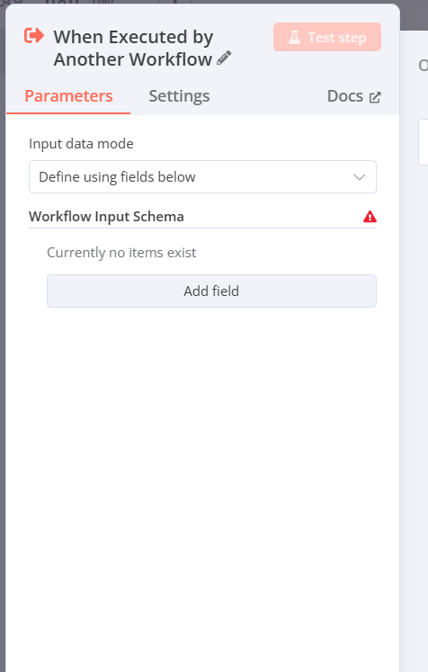

# 10. When Executed By another Workflow
Let’s explore the **When Executed by Another Workflow** trigger node in n8n, as shown in your image. This is a unique type of trigger we discussed earlier, categorized under "When Executed by Another Workflow," where the workflow starts when another workflow explicitly calls it using the "Execute Workflow" node. I’ll break this down in a beginner-friendly way, explain each part in detail, provide examples, and include real-world use cases. To make it engaging, I’ll use headings with icons and structure the content clearly!

---

## 🚀 Understanding the When Executed by Another Workflow Trigger in n8n

The **When Executed by Another Workflow** trigger in n8n allows one workflow to start another workflow by passing data or instructions between them. It’s like asking a friend to help you with a task: you (the first workflow) call your friend (the second workflow) and give them the details they need to get the job done. This trigger is part of n8n’s ability to create interconnected automations, making it ideal for breaking complex processes into manageable pieces.

Think of it as a relay race: one workflow passes the baton (data) to another, and the second workflow takes over from there.

---

## 🧩 Breakdown of the When Executed by Another Workflow Trigger Node

The image shows the configuration panel for the When Executed by Another Workflow node, with tabs for **Parameters**, **Settings**, and **Docs**. The **Parameters** tab is active, and it includes fields like Input Data Mode and Workflow Input Schema. Let’s break each part down step-by-step.

### 📥 1. Input Data Mode
- **What it is**: This dropdown determines how the workflow receives data from the calling workflow.
- **Options**: 
  - **Define using fields below** (selected in your image).
  - Other options might include "Auto-map" or "JSON" depending on the n8n version.
- **What it does**:
  - **Define using fields below**: Lets you manually specify the structure (schema) of the data the workflow expects from the calling workflow.
  - This mode gives you control to define exactly what data fields (e.g., "name," "email") the workflow will accept.
- **How it works**:
  - When another workflow uses the "Execute Workflow" node to call this workflow, it sends data.
  - You set up the expected fields in the "Workflow Input Schema" section to match the data being sent.
- **Example**: You set "Define using fields below" to receive order details. The calling workflow sends `{ "orderId": "123", "amount": "50" }`, and you define those fields to process them.
- **Real-World Use**: A sales workflow sends customer data to a payment workflow, which expects specific fields like "customerId" and "total."
- **Why use it?**: It ensures the workflow only accepts the data you expect, reducing errors from mismatched inputs.

### 📋 2. Workflow Input Schema
- **What it is**: This section defines the structure of the data the workflow will receive from the calling workflow.
- **Current State**: "Currently no items exist" with a warning icon (🔴), indicating no fields have been added yet.
- **Sub-options**:
  - **Add field**: A button to create fields in the schema.
- **What it does**:
  - The schema is like a blueprint that lists the fields (e.g., "name," "email") and their types (e.g., text, number) that the workflow expects.
  - The warning icon shows that the configuration is incomplete—you need to add at least one field for the trigger to work.
- **How it works**:
  - Click "Add field" to define a field name (e.g., "name") and its type or properties.
  - The calling workflow must send data matching this schema (e.g., `{ "name": "John" }`) for the trigger to process it correctly.
- **Example**:
  - You click "Add field" and create:
    - Field: "name," Type: Text.
    - Field: "age," Type: Number.
  - The calling workflow sends `{ "name": "Alice", "age": 25 }`, and this workflow uses that data.
- **Real-World Use**: A registration workflow sends `{ "userId": "user1", "role": "admin" }` to a user setup workflow that expects those fields.
- **Why use it?**: It validates the incoming data, ensuring the workflow only runs with the right information, which is crucial for complex automations.

### 🧪 3. Test Step Button
- **What it is**: The pink "Test step" button at the top.
- **What it does**: This allows you to test the trigger by simulating a call from another workflow with sample data.
- **How it works**:
  - Click "Test step" to generate a test execution, but since the schema is empty, you’ll need to add fields first.
  - Once fields are defined, you can send sample data (e.g., `{ "name": "Test" }`) to see how the workflow handles it.
- **Example**: After adding a "name" field, you click "Test step" and input `{ "name": "Bob" }` to verify the workflow processes it.
- **Real-World Use**: A developer tests a notification workflow by simulating a data call from a registration workflow.
- **Why use it?**: It helps you debug and confirm the trigger works with the expected data before integrating it with another workflow.

---

## 🌐 How the When Executed by Another Workflow Trigger Fits into a Workflow

This trigger starts the workflow when another workflow calls it using the "Execute Workflow" node, passing data between them. It’s designed for modular automation, where one workflow handles part of a process, and another takes over. For example:
- **Workflow Setup**:
  - **Workflow A (Caller)**: Uses an "On Webhook Call" trigger to receive order data and includes an "Execute Workflow" node to call Workflow B.
  - **Workflow B (Triggered)**: Uses the "When Executed by Another Workflow" trigger to process the order (e.g., update inventory).
- **Connection to Settings**: The "This workflow can be called by" setting (from workflow settings) must include Workflow A to allow the call.

---

## 📋 Example Workflow with When Executed by Another Workflow Trigger

**Scenario**: You run an online store and want to separate order processing into two workflows.
- **Setup**:
  - **Workflow A (Order Receiver)**:
    - Trigger: "On Webhook Call" with HTTP Method "POST."
    - Action: Receives order data (e.g., `{ "orderId": "123", "item": "Book" }`).
    - Node: "Execute Workflow" calls Workflow B, passing the data.
  - **Workflow B (Order Processor)**:
    - Trigger: "When Executed by Another Workflow."
    - Input Data Mode: "Define using fields below."
    - Workflow Input Schema: 
      - Field: "orderId," Type: Text.
      - Field: "item," Type: Text.
    - Action: Updates an Airtable base with the order details.
- **Action**: When a customer places an order, Workflow A receives it and triggers Workflow B to process it.
- **Real-World Use**: Automates a multi-step order process, improving efficiency.

**Complex Example**:
- **Setup**:
  - Workflow A: Collects form data with "On Form Submission" and calls Workflow B.
  - Workflow B: Schema includes "userId," "email," and "role."
  - Action: Workflow B creates a user account and sends a welcome email.
- **Real-World Use**: A membership site automates user registration and onboarding.

---

## 🌍 Real-World Use Case of When Executed by Another Workflow Trigger

**Business Example**: A marketing agency manages client campaigns with multiple steps.
- **Trigger Setup**:
  - Workflow A: Triggered by an "On Schedule" to check campaign progress daily.
  - Workflow B: Triggered by Workflow A with a schema for "campaignId," "status," and "budget."
- **Workflow**:
  - Workflow A collects campaign data from Airtable.
  - Workflow B analyzes the data, generates a report, and emails it to the client.
- **Benefit**: Breaks the process into manageable parts, allowing team specialization (e.g., data collection vs. reporting).

**Educational Example**: A school automates student record updates.
- **Trigger Setup**:
  - Workflow A: Triggered by "On Form Submission" when teachers submit grades.
  - Workflow B: Schema includes "studentId," "grade," and "course."
- **Workflow**: Workflow A collects grades, and Workflow B updates the student database and notifies parents.
- **Benefit**: Streamlines academic record-keeping and communication.

---

## 💡 Tips for Beginners
1. **Start with One Field**: Add a single field (e.g., "name") to the schema to get comfortable.
2. **Match Data**: Ensure the calling workflow sends data matching the schema to avoid errors.
3. **Test Early**: Use "Test step" after adding fields to verify the setup.
4. **Explore Settings**: Check the "This workflow can be called by" setting to control access.

---

## 🔗 Connecting to Previous Concepts
- **Triggers**: This is a "When Executed by Another Workflow" trigger, complementing others like "Webhook" and "On Form Submission."
- **Inactive Toggle**: The workflow must be active for the trigger to work.
- **Settings**: The "Error Workflow" setting can handle cases where the calling workflow sends invalid data.

---

Does this explanation of the When Executed by Another Workflow trigger make sense? If you’d like help setting up a specific schema or integrating it with another workflow, let me know! 😊 I can guide you step-by-step!