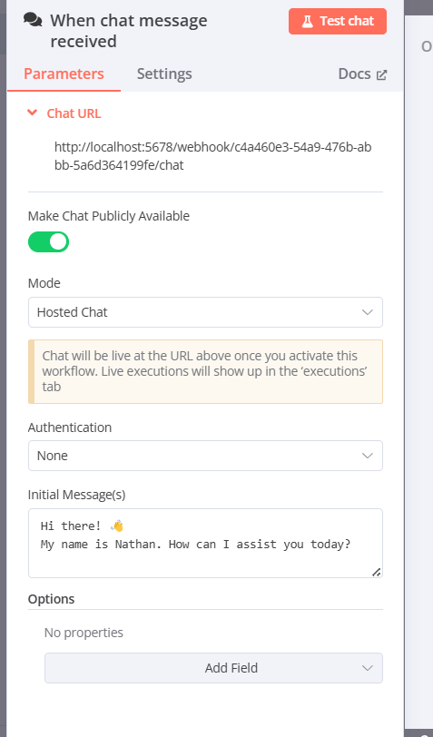
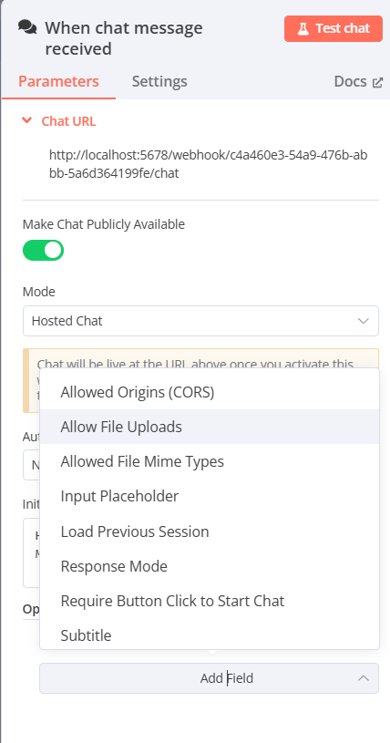

# 11. When chat message receive Trigger

Let’s dive into the **When Chat Message Received** trigger node in n8n, as shown in your image. This is a specific type of trigger we discussed earlier, categorized under "On Chat Message," where the workflow starts when a user sends a message in a chat interface created by n8n. I’ll break this down in a beginner-friendly way, explain each part in detail, provide examples, and include real-world use cases. To make it engaging, I’ll use headings with icons and structure the content clearly!

---

## 🚀 Understanding the When Chat Message Received Trigger in n8n

The **When Chat Message Received** trigger in n8n allows you to create a simple chat interface within n8n, share it with users, and start a workflow whenever someone sends a message in the chat. It’s like setting up a chatbot on your website: you provide a link for users to access the chat, and when they send a message, n8n captures it and triggers a workflow to respond or process the message.

Think of it as a friendly assistant: you set up a chat window where users can talk to your automation, and n8n listens for their messages to take action—like answering questions, logging inquiries, or even integrating with AI to provide smart responses.

---

## 🧩 Breakdown of the When Chat Message Received Trigger Node

The image shows the configuration panel for the When Chat Message Received node, with tabs for **Parameters**, **Settings**, and **Docs**. The **Parameters** tab is active, and it includes fields like Chat URL, Make Chat Publicly Available, Mode, Authentication, Initial Message(s), and Options. Let’s break each part down step-by-step.

### 🌐 1. Chat URL
- **What it is**: This is the URL where users can access the chat interface.
- **Value**: `http://localhost:5678/webhook/c44a60e3-5499-476b-abbb-5a6d364199fe/chat`
- **What it does**: 
  - This URL is the link to the chat page that n8n generates.
  - Share this URL with users, and they can open it in a browser to start chatting.
- **How it works**:
  - n8n creates this URL automatically when you add the When Chat Message Received node.
  - The chat becomes live once you save and activate the workflow (using the "Inactive" toggle).
- **Example**: You copy the Chat URL and send it to a friend. They open it, see a chat window, and type “Hello!”—triggering your workflow.
- **Real-World Use**: A small business shares the Chat URL on their website for customers to ask questions.
- **Why use it?**: It provides an easy way for users to interact with your automation via a chat interface.

### 🔓 2. Make Chat Publicly Available
- **What it is**: A toggle to control whether the chat is accessible to everyone.
- **Options**: On (green, selected in your image) or Off.
- **What it does**:
  - **On**: Anyone with the Chat URL can access the chat (public).
  - **Off**: The chat is private and requires authentication to access.
- **How it works**:
  - With "On," the chat is open to anyone who has the URL.
  - If turned "Off," you’d need to set up authentication (e.g., a password) to restrict access.
- **Example**: You set it to "On" for a public support chat. Customers visit the URL and start chatting without logging in.
- **Real-World Use**: A nonprofit sets the chat to "On" for a public Q&A session during a fundraiser.
- **Why use it?**: It makes the chat accessible to a wider audience, which is great for public-facing interactions.

### 📡 3. Mode
- **What it is**: This dropdown sets the type of chat interaction.
- **Options**: 
  - **Hosted Chat** (selected in your image).
  - Other options might include "Embedded Chat" (depending on the n8n version).
- **What it does**:
  - **Hosted Chat**: n8n hosts the chat at the Chat URL, and users visit that URL to interact.
  - **Embedded Chat**: The chat can be embedded into a website (e.g., as a widget), but this requires additional setup.
- **How it works**:
  - With "Hosted Chat," users go to the provided URL to chat.
  - The note below says: “Chat will be live at the URL above once you activate this workflow. Live executions will show up in the ‘executions’ tab.”
- **Example**: You choose "Hosted Chat" and share the URL with your team. They open it and start chatting with the bot.
- **Real-World Use**: A customer support team uses "Hosted Chat" for a dedicated support channel.
- **Why use it?**: It’s the simplest way to set up a chat interface without needing to embed it in a website.

### 🔒 4. Authentication
- **What it is**: This determines if users need to log in or provide credentials to access the chat.
- **Options**: Dropdown with choices like "None" (selected in your image), "Basic Auth," or "Header Auth."
- **What it does**:
  - **None**: Anyone with the URL can access the chat (no security).
  - **Basic Auth**: Requires a username and password to access the chat.
  - **Header Auth**: Requires a specific key in the request headers (advanced).
- **How it works**:
  - With "None," the chat is open to everyone.
  - With authentication enabled, only authorized users can access the chat.
- **Example**: You set Authentication to "None" for a public FAQ chat. For an internal team chat, you might use "Basic Auth" to restrict access.
- **Real-World Use**: A company uses "Basic Auth" for an employee-only chat to discuss project updates.
- **Why use it?**: It adds security, protecting the chat from unauthorized access when needed.

### 💬 5. Initial Message(s)
- **What it is**: This is the first message(s) the chat displays to users when they open it.
- **Value**: “Hi there! 👋 My name is Nathan. How can I assist you today?” (in your image).
- **What it does**: It sets a welcoming message to greet users and guide them on what to do.
- **How it works**:
  - Enter one or more messages in the text box.
  - When a user opens the chat, they see this message as the starting point of the conversation.
- **Example**: You set the initial message to “Welcome to our support chat! How can I help you?” Users see this when they start the chat.
- **Real-World Use**: An online store uses “Hello! Need help with your order? Ask away!” to encourage customers to ask questions.
- **Why use it?**: It makes the chat friendly and gives users a clear starting point, improving their experience.

### 🔧 6. Options (Parameters Tab)
- **What it is**: This section lets you add extra parameters to customize the chat’s behavior.
- **Options**: "No properties" (default), with an "Add Field" button.
- **What it does**: You can add advanced settings, like custom styling or behavior, for the chat.
- **How it works**: Click "Add Field" to add options like "Chat Title" or "Theme."
- **Example**: You add a field "Chat Title" with value "Support Chat" to display a custom title on the chat window.
- **Real-World Use**: A developer adds a "Theme" field to change the chat’s colors to match their brand.
- **Why use it?**: It provides flexibility to customize the chat’s appearance or functionality.

### ⚙️ 7. Options (Settings Tab)
The **Settings** tab (shown in the second image) provides additional configuration options for the chat. Let’s break these down:

- **Allowed Origins (CORS)**: 
  - **What it is**: Controls which websites can embed the chat (if using Embedded Chat mode).
  - **Example**: You set it to `https://yourwebsite.com` to allow embedding only on your site.
  - **Use**: Ensures security by restricting where the chat can be used.

- **Allow File Uploads**:
  - **What it is**: A toggle to enable/disable file uploads in the chat.
  - **Example**: Turn it on to let users upload images or documents.
  - **Use**: Useful for support chats where users need to share files.

- **Allowed File MIME Types**:
  - **What it is**: Specifies which file types users can upload (e.g., "image/png").
  - **Example**: Set to "image/*" to allow all image types.
  - **Use**: Restricts uploads to safe file types.

- **Input Placeholder**:
  - **What it is**: The placeholder text in the chat input box.
  - **Example**: Set to "Type your message here" to guide users.
  - **Use**: Improves user experience by providing a hint.

- **Load Previous Session**:
  - **What it is**: A toggle to load the user’s previous chat history.
  - **Example**: Turn it on to show past messages when a user returns.
  - **Use**: Maintains continuity in conversations.

- **Response Mode**:
  - **What it is**: Controls how the chat responds to messages.
  - **Example**: Options might include "Immediate" or "After Workflow Completes."
  - **Use**: Determines when users see responses.

- **Require Button Click to Start Chat**:
  - **What it is**: A toggle to require a button click to open the chat.
  - **Example**: Turn it on to show a “Start Chat” button before the chat opens.
  - **Use**: Prevents the chat from auto-opening, reducing intrusiveness.

- **Subtitle**:
  - **What it is**: A subtitle displayed below the chat title.
  - **Example**: Set to "Available 9 AM - 5 PM" to inform users.
  - **Use**: Provides additional context or instructions.

---

## 🌟 How the When Chat Message Received Trigger Fits into a Workflow

This trigger starts the workflow when a user sends a message in the chat, passing the message (and any other data, like user ID) to the next nodes. For example:
- **Workflow**:
  - **Trigger**: When Chat Message Received.
  - **Next Node**: A node checks the message and responds (e.g., using a "Send Message" node).
- **Connection to Settings**: The "Error Workflow" setting can handle cases where the chat fails to process a message.

---

## 📋 Example Workflow with When Chat Message Received Trigger

**Scenario**: You’re a small business owner and want to set up a customer support chat.
- **Setup**:
  - **Chat URL**: Share the URL on your website.
  - **Make Chat Publicly Available**: On.
  - **Mode**: Hosted Chat.
  - **Authentication**: None.
  - **Initial Message**: “Hi! How can I assist you today?”
- **Action**: When a customer sends a message (e.g., “I need help with my order”), the workflow logs the message to Airtable and sends a reply like “Please provide your order number.”
- **Real-World Use**: Automates customer support, saving time and improving response rates.

**Complex Example**:
- **Setup**:
  - Initial Message: “Welcome! Ask me anything or type ‘FAQ’ for help.”
  - Options: Load Previous Session (On).
- **Action**: If the user types “FAQ,” the workflow responds with a list of FAQs; otherwise, it forwards the message to a support team via Slack.
- **Real-World Use**: A tech company uses this to handle common queries automatically while escalating complex ones.

---

## 🌍 Real-World Use Case of When Chat Message Received Trigger

**Business Example**: A small online store sets up a support chat.
- **Trigger Setup**:
  - Initial Message: “Hello! Need help with your shopping? 😊”
  - Make Chat Publicly Available: On.
  - Options: Allow File Uploads (On), Input Placeholder: “Ask us anything!”
- **Workflow**:
  - The chat URL is added to the store’s website.
  - When a customer asks, “Where is my order?” the workflow checks the order status in Airtable and replies with the details.
- **Benefit**: Provides instant support, enhancing customer satisfaction.

**Educational Example**: A teacher creates a Q&A chat for students.
- **Trigger Setup**:
  - Initial Message: “Hi students! Ask your questions here.”
  - Authentication: Basic Auth (to restrict to students).
- **Workflow**: Messages are logged to Google Sheets, and the teacher receives a Slack notification for each question.
- **Benefit**: Streamlines communication and tracks student inquiries.

---

## 💡 Tips for Beginners
1. **Start Simple**: Begin with a basic initial message and test the chat with a friend.
2. **Test the Chat**: Use the "Test chat" button to see how it looks and works.
3. **Secure When Needed**: Use Authentication for private chats to protect access.
4. **Customize Responses**: Add nodes to respond dynamically to user messages.

---

## 🔗 Connecting to Previous Concepts
- **Triggers**: This is an "On Chat Message" trigger, complementing others like "On Form Submission" and "Webhook."
- **Inactive Toggle**: The chat only works when the workflow is active.
- **Settings**: The "Error Workflow" setting can handle chat failures.

---

Does this explanation of the When Chat Message Received trigger make sense? If you’d like help setting up a specific chat or need more examples, let me know! 😊 I can guide you step-by-step!