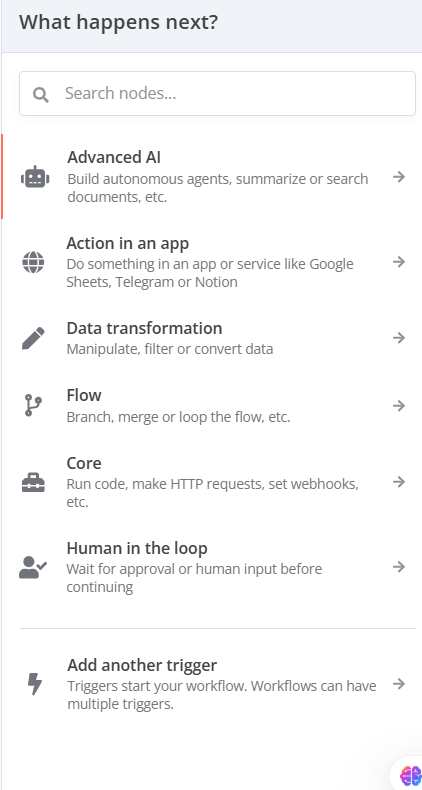

Let’s dive into the **"What happens next?"** panel in n8n, as shown in your image. This panel appears after you’ve added a trigger node (like "On Form Submission" or "Webhook") to your workflow, prompting you to decide the next step in your automation. It’s a key part of building workflows in n8n, helping you choose what actions or logic to add after the trigger starts the workflow. I’ll explain this concept in a beginner-friendly way, break down each option in detail, provide examples, and include real-world use cases. Let’s make it engaging with clear headings and examples!

---

## 🚀 Understanding the "What Happens Next?" Panel in n8n

The **"What happens next?"** panel in n8n is a menu that appears after you’ve set up a trigger node in your workflow. It’s like a roadmap for your automation: the trigger (e.g., "On Form Submission") starts the workflow, and this panel helps you decide what should happen afterward. You can add nodes to perform actions, transform data, control the flow, or even add another trigger.

Think of it as planning a party: the trigger is the invitation that gets the party started (e.g., guests arriving), and the "What happens next?" panel lets you decide what activities come next—like playing music, serving food, or taking photos.

---

## 🧩 Breakdown of the "What Happens Next?" Panel Options

The panel lists several categories of nodes you can add to your workflow, each serving a different purpose. Let’s break down each option in detail, explain what it does, and give examples to make it clear.

### 🔍 Search Nodes...
- **What it is**: A search bar at the top of the panel.
- **What it does**: Allows you to quickly find a specific node by typing its name (e.g., "Google Sheets" or "Send Email").
- **How it works**:
  - Start typing the name of a node, and n8n will show matching options.
  - Select the node to add it to your workflow.
- **Example**: You type "Slack" and select the "Slack" node to send a message to your team.
- **Real-World Use**: A marketer searches for "Email" to add a node that sends a confirmation email after a form submission.
- **Why use it?**: It’s a fast way to find the exact node you need without scrolling through categories.

### 🤖 Advanced AI
- **What it is**: A category for nodes that use artificial intelligence (AI) to perform tasks like summarizing text, answering questions, or searching documents.
- **What it does**: Adds AI-powered nodes to your workflow, such as integrating with tools like OpenAI (for ChatGPT) or other AI services.
- **How it works**:
  - Select this category to see AI-related nodes.
  - Add a node (e.g., "OpenAI") and configure it to process data (e.g., summarize a customer message).
- **Example**:
  - After a "When Chat Message Received" trigger, you add an "OpenAI" node to generate a smart reply to a user’s question like “What’s your return policy?”
  - The node responds with “Our return policy allows returns within 30 days with a receipt.”
- **Real-World Use**: A customer support team uses an AI node to automatically answer FAQs in a chat, saving time for simple queries.
- **Why use it?**: It adds intelligence to your workflows, automating tasks that require analysis or natural language processing.

### 🌍 Action in an App
- **What it is**: A category for nodes that interact with external apps or services, like Google Sheets, Slack, or Notion.
- **What it does**: Adds nodes that perform actions in apps, such as sending messages, updating spreadsheets, or creating tasks.
- **How it works**:
  - Select this category to see a list of supported apps (e.g., Google Sheets, Telegram, Airtable).
  - Add a node and configure it to connect to your app and perform an action.
- **Example**:
  - After an "On Form Submission" trigger, you add a "Google Sheets" node to save form data (e.g., "Name" and "Email") to a spreadsheet.
- **Real-World Use**: A small business uses a "Slack" node to send a notification to their team whenever a new order is received via a webhook.
- **Why use it?**: It connects your workflow to the tools you already use, automating tasks across apps.

### 📊 Data Transformation
- **What it is**: A category for nodes that manipulate, filter, or convert data in your workflow.
- **What it does**: Adds nodes like "Set," "Filter," or "Merge" to change or organize the data coming from the trigger.
- **How it works**:
  - Select this category to see data transformation nodes.
  - Add a node to modify the data (e.g., filter out specific entries or combine data from multiple sources).
- **Example**:
  - After a "Webhook" trigger receives order data, you add a "Filter" node to process only orders with a total above $50.
  - Then, you add a "Set" node to add a new field like "Processed: Yes."
- **Real-World Use**: An e-commerce store filters customer feedback from a form to only process 5-star reviews for a marketing campaign.
- **Why use it?**: It helps you clean, organize, or adjust data before taking further actions, ensuring your workflow uses the right information.

### 🔄 Flow
- **What it is**: A category for nodes that control the flow of your workflow, like branching, merging, or looping.
- **What it does**: Adds nodes like "If," "Merge," or "Loop" to manage how the workflow proceeds based on conditions or data.
- **How it works**:
  - Select this category to see flow control nodes.
  - Add a node to create conditional paths or repeat actions.
- **Example**:
  - After an "On Form Submission" trigger, you add an "If" node to check if the user’s age is over 18.
  - If true, the workflow sends a confirmation email; if false, it stops.
- **Real-World Use**: A school uses an "If" node to check if a student’s grade (from a form) is above 80, then sends a congratulatory message via Telegram.
- **Why use it?**: It adds logic to your workflow, allowing you to handle different scenarios or repeat tasks as needed.

### 💻 Core
- **What it is**: A category for fundamental nodes that perform basic tasks, like running code or making HTTP requests.
- **What it does**: Adds nodes like "Code," "HTTP Request," or "Set Webhook" to execute custom logic or interact with APIs.
- **How it works**:
  - Select this category to see core nodes.
  - Add a node to perform a task, such as running JavaScript code or sending a request to an external API.
- **Example**:
  - After a "Schedule Trigger" runs daily, you add a "Code" node to calculate the total sales from the day’s data.
  - Then, you add an "HTTP Request" node to send the total to an external dashboard.
- **Real-World Use**: A developer uses a "Code" node to process raw data from a webhook and format it for storage in a database.
- **Why use it?**: It provides low-level control for advanced tasks, like custom calculations or API integrations.

### 👥 Human in the Loop
- **What it is**: A category for nodes that pause the workflow and wait for human input before continuing.
- **What it does**: Adds nodes like "Wait for Approval" to involve a human in the automation process.
- **How it works**:
  - Select this category to see human-in-the-loop nodes.
  - Add a node to pause the workflow and wait for someone to approve or provide input.
- **Example**:
  - After a "When Chat Message Received" trigger, you add a "Wait for Approval" node to pause the workflow.
  - A manager reviews the user’s message (e.g., a refund request) and approves it, then the workflow continues to process the refund.
- **Real-World Use**: A finance team uses this to approve large transactions before they’re processed automatically.
- **Why use it?**: It ensures critical decisions are reviewed by a human, adding oversight to your automation.

### ⚡ Add Another Trigger
- **What it is**: An option to add another trigger to the same workflow.
- **What it does**: Allows your workflow to start from multiple events, combining different triggers (e.g., "On Form Submission" and "Schedule Trigger").
- **How it works**:
  - Select this option to add another trigger node.
  - Configure the new trigger, and the workflow will start whenever any of the triggers activate.
- **Example**:
  - You have a workflow with an "On Form Submission" trigger to collect feedback.
  - You add a "Schedule Trigger" to run daily and remind users to submit feedback if they haven’t.
- **Real-World Use**: A retailer uses a "Webhook" trigger for new orders and a "Schedule Trigger" to check inventory daily, all in one workflow.
- **Why use it?**: It makes your workflow more versatile by allowing multiple starting points.

---

## 🌟 How the "What Happens Next?" Panel Fits into a Workflow

This panel is the bridge between your trigger and the actions in your workflow. After the trigger starts the workflow (e.g., a form submission), you use this panel to decide what happens next—whether it’s saving data, sending a notification, or adding logic. For example:
- **Workflow**:
  - **Trigger**: "On Form Submission" collects user data.
  - **What Happens Next?**: Add an "Action in an App" node (Google Sheets) to save the data, then a "Flow" node (If) to check if the user is a VIP, and finally an "Action in an App" node (Email) to send a thank-you.
- **Connection to Settings**: The "Error Workflow" setting can handle failures in any of these steps.

---

## 📋 Example Workflow Using the "What Happens Next?" Panel

**Scenario**: You’re a small business owner collecting customer feedback.
- **Setup**:
  - **Trigger**: "On Form Submission" with fields "Name" and "Feedback."
  - **What Happens Next?**:
    - **Action in an App**: Add a "Google Sheets" node to save the form data.
    - **Data Transformation**: Add a "Filter" node to process only positive feedback (e.g., ratings above 4).
    - **Action in an App**: Add a "Slack" node to notify your team about the positive feedback.
- **Action**: When a customer submits feedback, it’s saved, filtered, and shared with your team.
- **Real-World Use**: Automates feedback processing, ensuring your team focuses on positive reviews.

**Complex Example**:
- **Setup**:
  - **Trigger**: "Webhook" for new orders.
  - **What Happens Next?**:
    - **Flow**: Add an "If" node to check if the order total is over $100.
    - **Human in the Loop**: Add a "Wait for Approval" node for high-value orders.
    - **Advanced AI**: Add an "OpenAI" node to generate a personalized thank-you message.
    - **Action in an App**: Add an "Email" node to send the message.
- **Action**: Orders over $100 are reviewed by a human, then a custom email is sent.
- **Real-World Use**: Enhances customer experience with personalized communication.

---

## 🌍 Real-World Use Cases of the "What Happens Next?" Panel

**Business Example**: A small online store automates order processing.
- **Setup**:
  - Trigger: "Webhook" for new orders.
  - What Happens Next?:
    - Action in an App: "Airtable" node to log the order.
    - Data Transformation: "Set" node to add a "Processed" flag.
    - Flow: "If" node to check if the order needs expedited shipping.
    - Action in an App: "Email" node to notify the customer.
- **Benefit**: Streamlines order handling, ensuring timely updates for customers.

**Educational Example**: A teacher collects and processes student submissions.
- **Setup**:
  - Trigger: "On Form Submission" for homework submissions.
  - What Happens Next?:
    - Action in an App: "Google Sheets" node to save submissions.
    - Flow: "If" node to check if the submission is late.
    - Human in the Loop: "Wait for Approval" node for late submissions.
    - Action in an App: "Email" node to notify the student of approval.
- **Benefit**: Automates grading workflows while allowing teacher oversight for exceptions.

---

## 💡 Tips for Beginners
1. **Start Simple**: Begin with one node (e.g., "Action in an App" to save data) to get comfortable.
2. **Experiment**: Try different categories (e.g., "Flow" for conditions) to see how they work.
3. **Test Often**: After adding a node, test the workflow to ensure it behaves as expected.
4. **Combine Nodes**: Use multiple categories (e.g., "Data Transformation" then "Action in an App") to build more complex workflows.

---

## 🔗 Connecting to Previous Concepts
- **Triggers**: This panel comes after setting up a trigger like "On Form Submission" or "Webhook."
- **Inactive Toggle**: The workflow must be active for the nodes to execute.
- **Settings**: The "Timeout Workflow" setting can stop the workflow if a node takes too long.

---

Does this explanation of the "What Happens Next?" panel make sense? If you’d like help building a specific workflow or need more examples, let me know! 😊 I can guide you step-by-step!