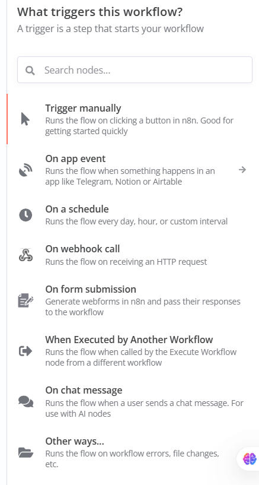

Let’s dive into the image you’ve shared! It shows a section from a tool (likely n8n, a popular workflow automation platform) where you can choose a **trigger** to start a workflow. A trigger is like the "starting gun" for a process—it’s the event or action that kicks off the series of steps in your workflow. Think of it as the moment something happens that tells the system, "Hey, it’s time to get to work!" The image lists various types of triggers, and I’ll explain each one in detail, keeping it simple for beginners, with examples and real-world applications.

---

### What is a Trigger?
A trigger is the first step in a workflow that tells the automation tool when to start executing the tasks you’ve set up. Without a trigger, your workflow would just sit there doing nothing—it needs something to "wake it up." The image provides several options for triggers, and each one serves a different purpose based on how or when you want your workflow to begin.

---

### Types of Triggers Explained

#### 1. Trigger Manually
- **What it does**: This option lets you start the workflow by clicking a button in the n8n interface. It’s a manual process, meaning you control when it runs.
- **How it works**: You set up the workflow, and whenever you’re ready, you go to n8n, find the workflow, and click a "Run" button. It’s great for testing or one-off tasks.
- **Example**: Imagine you’re a small business owner managing a mailing list. You create a workflow to send a promotional email. You use "Trigger Manually" to test the email design before sending it to your customers.
- **Real-World Use**: A teacher could use this to manually run a workflow that generates a report of student grades whenever they finish grading a test, allowing them to review it before sharing.

#### 2. On App Event
- **What it does**: This trigger starts the workflow when something happens in a connected app, like Telegram, Notion, or Airtable.
- **How it works**: You link n8n to an app (e.g., Telegram), and when a specific event occurs (e.g., a new message), the workflow kicks off. You need to set up the app integration first.
- **Example**: You connect n8n to Telegram. Whenever someone sends a "Hello" message in a group chat, the workflow sends an automated reply like "Hi! How can I help you?"
- **Real-World Use**: A customer support team could use this to automatically log a support ticket in Airtable whenever a new email arrives in their support inbox.

#### 3. On a Schedule
- **What it does**: This runs the workflow at set times, like every day, every hour, or a custom interval (e.g., every Monday at 9 AM).
- **How it works**: You configure a schedule (e.g., "run every day at 8 AM"), and n8n will automatically start the workflow at those times.
- **Example**: You set a workflow to check your email every morning at 7 AM and send you a summary of new messages.
- **Real-World Use**: A freelancer could use this to automatically back up their project files to Google Drive every night at midnight, ensuring data safety.

#### 4. On Webhook Call
- **What it does**: This trigger starts the workflow when an external system sends an HTTP request to n8n.
- **How it works**: You get a unique URL from n8n (a webhook URL), and when another app or service sends data to that URL, the workflow runs. It’s like giving someone a phone number to call you.
- **Example**: You create a form on your website. When someone submits the form, it sends data to the webhook URL, and n8n starts a workflow to save the data to a spreadsheet.
- **Real-World Use**: An e-commerce store could use this to trigger an inventory update in their database whenever a new order is placed on their website.

#### 5. On Form Submission
- **What it does**: This generates web forms within n8n, and the workflow starts when someone fills out and submits the form.
- **How it works**: You design a form in n8n (e.g., name, email, message), share the form link, and when someone submits it, the workflow processes the responses.
- **Example**: You create a feedback form for a product. When customers submit their feedback, the workflow sends you an email with their responses.
- **Real-World Use**: A nonprofit organization could use this to collect event RSVPs. When someone submits the form, the workflow adds their name to an attendee list and sends a confirmation email.

#### 6. When Executed by Another Workflow
- **What it does**: This trigger runs the workflow when another workflow calls it using the "Execute Workflow" node.
- **How it works**: You have two workflows: Workflow A and Workflow B. Workflow A uses a node to tell Workflow B to start, passing data between them.
- **Example**: Workflow A processes new customer orders, and when it’s done, it triggers Workflow B to send a thank-you email to the customer.
- **Real-World Use**: A marketing team could use this to automate a multi-step campaign: Workflow A collects leads, and Workflow B sends follow-up emails a week later.

#### 7. On Chat Message
- **What it does**: This starts the workflow when a user sends a chat message, often used with AI features.
- **How it works**: You connect n8n to a chat platform (e.g., Slack or Discord), and when someone sends a message (e.g., "Help"), the workflow responds, possibly using AI to generate a reply.
- **Example**: In a Slack channel, when someone types "Status," the workflow checks a project management tool and replies with the latest update.
- **Real-World Use**: A tech support team could use this to automate responses to common questions in a company’s Slack, improving efficiency.

#### 8. Other Ways…
- **What it does**: This hints at additional triggers like workflow errors, file changes, etc., which depend on the tools and integrations you use.
- **How it works**: These are more advanced and context-specific. For example, a workflow could start if a file is uploaded to a cloud storage service like Google Drive.
- **Example**: A workflow triggers when a new photo is uploaded to a shared Google Drive folder, resizing the image and saving it in a new location.
- **Real-World Use**: A content creator could use this to automatically compress and organize video files uploaded to Dropbox for editing.

---

### How to Choose a Trigger
As a beginner, think about **when** and **how** you want your workflow to start:
- If you need control, use **Trigger Manually**.
- If it’s based on an app, use **On App Event**.
- If it’s time-based, use **On a Schedule**.
- If it’s from an external system, use **On Webhook Call** or **On Form Submission**.
- If it’s part of a bigger process, use **When Executed by Another Workflow**.
- If it’s chat-based, use **On Chat Message**.
- For advanced cases, explore **Other Ways…**.

---

### Real-World Example Combining Multiple Triggers
Let’s imagine you run a small online store:
- **Trigger 1: On Webhook Call** - A customer places an order on your website, sending data to n8n via a webhook.
- **Trigger 2: On App Event** - The order data updates your Airtable inventory, triggering a notification in Slack.
- **Trigger 3: On a Schedule** - Every morning at 6 AM, a workflow checks for pending orders and sends a reminder to your team.
- **Trigger 4: On Form Submission** - Customers fill out a feedback form after delivery, and the workflow logs their responses.

This combination automates order processing, inventory management, team communication, and customer feedback—all starting with different triggers!

---

### Tips for Beginners
1. **Start Simple**: Try "Trigger Manually" to get comfortable with workflows.
2. **Test Often**: Use manual triggers to test each step before setting up automatic ones.
3. **Learn Integrations**: Explore apps like Google Sheets, Slack, or email to see what events you can trigger.
4. **Ask for Help**: If you’re unsure about a trigger, let me know, and I can offer to search for more details!

Does this make sense? Let me know if you’d like me to dive deeper into any specific trigger or example!