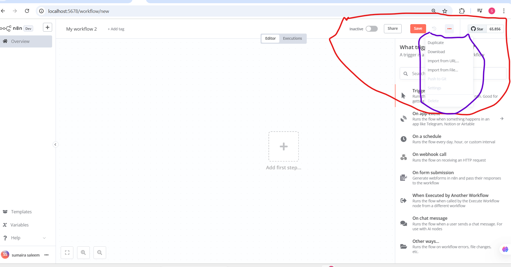

Let’s dive into the details of the elements you’ve asked about from the n8n interface in the image: the **Inactive** toggle, the **Share** button, and the menu you’ve highlighted with a purple marker (which includes options like Duplicate, Import from URL, Import from File, Push to Git, Settings, and Delete). I’ll explain each one in a beginner-friendly way, provide examples, and connect them to real-world uses. Since this builds on our previous discussions about triggers and tags, I’ll also tie those concepts in where relevant.

---

### 1. Inactive Toggle
- **What it is**: The "Inactive" toggle is a switch next to the workflow name ("My workflow 2" in your image). It indicates whether the workflow is currently active or inactive.
- **What it does**:
  - When the toggle is **off** (gray, as shown in your image), the workflow is inactive. This means it won’t run, even if its trigger (e.g., "On a Schedule" or "On Webhook Call") is activated.
  - When you turn it **on** (green), the workflow becomes active and will execute based on its trigger.
- **How it works**: Think of it like a light switch. When the switch is off, the light doesn’t turn on, no matter how many times you press the button. Similarly, an inactive workflow won’t start, even if the trigger conditions are met.
- **Example**: Suppose you’ve set up a workflow with an "On a Schedule" trigger to send a daily sales report at 8 AM. If the workflow is inactive, it won’t send the report until you turn the toggle to active.
- **Real-World Use**: 
  - A small business owner might set up a workflow to process customer orders but keep it inactive until the website is live. Once the site launches, they turn it active.
  - A developer might keep a workflow inactive while testing it to avoid accidental runs.
- **Why use it?**: It gives you control to pause a workflow without deleting it. This is useful for testing, maintenance, or when you don’t need the workflow to run temporarily.

---

### 2. Share Button
- **What it is**: The "Share" button is located in the top-right corner of the workflow editor, next to the "Save" button.
- **What it does**: Clicking "Share" allows you to generate a link or invite others to view or collaborate on the workflow. This is useful for teamwork or sharing your automation with others.
- **How it works**: When you click "Share," n8n provides options to:
  - Generate a shareable link (e.g., for viewing the workflow).
  - Invite specific users (if you’re using n8n with a team or cloud version) to edit or view the workflow.
  - Set permissions (e.g., view-only or edit access).
  - The link or invitation can be sent via email or copied to share manually.
- **Example**: You’ve created a workflow to automate customer feedback collection using the "On Form Submission" trigger. You click "Share" to send a link to your marketing team so they can review it before it goes live.
- **Real-World Use**:
  - A project manager could share a workflow with their team to get feedback on an automated task scheduler.
  - A freelancer might share a workflow with a client to demonstrate how their automation solution works.
- **Why use it?**: It enables collaboration, feedback, and transparency. Instead of explaining a workflow verbally, you can share it directly, saving time and reducing errors.

---

### 3. Purple-Hhighlighted Menu (Workflow Options)
You’ve highlighted a dropdown menu in purple, which appears when you click the three dots (⋮) next to the "Save" button. This menu contains several options: **Duplicate**, **Import from URL**, **Import from File**, **Push to Git**, **Settings**, and **Delete**. Let’s explore each one in detail.

#### a. Duplicate
- **What it is**: This option creates a copy of the current workflow.
- **What it does**: When you select "Duplicate," n8n makes an identical version of "My workflow 2," which you can then modify without affecting the original.
- **How it works**: After duplicating, a new workflow (e.g., "My workflow 2 - Copy") is created. You can rename it, adjust the trigger (e.g., from "On a Schedule" to "On Webhook Call"), or add new steps.
- **Example**: You have a workflow that sends weekly reports with an "On a Schedule" trigger. You duplicate it to create a similar workflow for monthly reports, then change the schedule to run once a month.
- **Real-World Use**: A marketer might duplicate a campaign email workflow to create a new version for a different product, tweaking only the content.
- **Why use it?**: It saves time by avoiding the need to rebuild a workflow from scratch. It’s like photocopying a document to make edits without ruining the original.

#### b. Import from URL
- **What it is**: This option lets you import a workflow from a URL (web address) where the workflow data is hosted.
- **What it does**: You paste a URL (provided by someone else or from n8n’s export feature), and n8n downloads and loads that workflow into your editor.
- **How it works**: Someone exports a workflow as a JSON file and hosts it online (e.g., on GitHub or a personal server). You enter that URL, and n8n imports it, allowing you to use or edit it.
- **Example**: You find a pre-built workflow for Slack notifications on the n8n community site. The site provides a URL, and you use "Import from URL" to add it to your n8n instance.
- **Real-World Use**: A developer could share a workflow template via a URL with their team, who can import it to start working on it immediately.
- **Why use it?**: It’s a quick way to bring in pre-made or shared workflows, especially if you’re new and want to learn from others’ setups.

#### c. Import from File
- **What it is**: This option allows you to upload a workflow file (usually in JSON format) from your computer.
- **What it does**: You select a file you’ve downloaded or created elsewhere, and n8n imports it as a new workflow.
- **How it works**: You export a workflow from n8n or another source as a JSON file, save it to your computer, then use "Import from File" to upload it. The workflow appears in your editor.
- **Example**: You export a workflow for customer order processing from your work computer, take it home on a USB drive, and import it into your personal n8n instance using this option.
- **Real-World Use**: A small business owner might import a workflow file from a consultant who designed an inventory management system.
- **Why use it?**: It’s useful for transferring workflows between devices or backing up your work manually.

#### d. Push to Git
- **What it is**: This option integrates n8n with Git, a version control system, to save your workflow to a Git repository.
- **What it does**: It uploads your workflow (as a file) to a Git service (e.g., GitHub, GitLab) for version tracking and collaboration.
- **How it works**: You need to connect n8n to a Git account and repository. When you select "Push to Git," the workflow is saved there, allowing you to track changes over time.
- **Example**: You’ve built a workflow with an "On Chat Message" trigger for team updates. You push it to GitHub so your team can review and update it collaboratively.
- **Real-World Use**: A development team might use this to manage complex workflows, ensuring everyone has the latest version and can roll back if needed.
- **Why use it?**: It’s ideal for advanced users or teams who need version control and collaboration features, similar to coding projects.

#### e. Settings
- **What it is**: This opens a settings panel for the workflow.
- **What it does**: It lets you configure workflow-specific options, such as the name, description, or advanced settings (e.g., timeout limits or error handling).
- **How it works**: Clicking "Settings" brings up a form where you can edit details. For example, you might change "My workflow 2" to "Customer Feedback System."
- **Example**: You set a description in Settings like "Automates feedback collection via form submission" to remind yourself of its purpose.
- **Real-World Use**: A manager might use Settings to add notes about who maintains the workflow or when it was last updated.
- **Why use it?**: It helps document and customize the workflow, making it easier to manage, especially for larger projects.

#### f. Delete
- **What it is**: This option permanently removes the workflow.
- **What it does**: Clicking "Delete" deletes "My workflow 2" from n8n. This action cannot be undone, so it’s a final step.
- **How it works**: A confirmation prompt usually appears to ensure you want to delete. Once confirmed, the workflow is gone.
- **Example**: You created a test workflow with a "Trigger Manually" trigger that you no longer need, so you delete it to keep your workspace clean.
- **Real-World Use**: A business might delete an old workflow for a discontinued product to avoid confusion.
- **Why use it?**: It helps declutter your n8n instance, removing workflows that are obsolete or irrelevant.

---

### Connecting Triggers, Tags, and These Features
Let’s tie this all together with an example:
- **Workflow**: You create "My workflow 2" with an "On Form Submission" trigger to collect customer feedback.
- **Tags**: You add tags like "Feedback" and "Support" for organization.
- **Inactive Toggle**: You keep it inactive while testing, then activate it when ready.
- **Share**: You share the workflow with your team for feedback via the "Share" button.
- **Duplicate**: You duplicate it to create a version for employee feedback, tweaking the form.
- **Import from File**: You import a backup of the workflow after making changes.
- **Push to Git**: Your team pushes it to GitHub for version control.
- **Settings**: You add a description like "Customer feedback automation."
- **Delete**: After the project ends, you delete the workflow.

This shows how these features work together to build, manage, and maintain workflows.

---

### Tips for Beginners
- **Use Inactive Wisely**: Keep workflows inactive during setup to avoid unintended runs.
- **Share with Care**: Only share with trusted people, and use view-only links if needed.
- **Experiment with Duplicate**: Try duplicating a simple workflow to learn without risking the original.
- **Backup Before Deleting**: Export a workflow (via Import/Export) before deleting it, just in case.

---

Does this clarify the "Inactive" toggle, "Share" button, and the purple-highlighted menu? If you’d like more examples or help with a specific option, let me know! I can also guide you through setting up a sample workflow if you’re ready to try. 😊