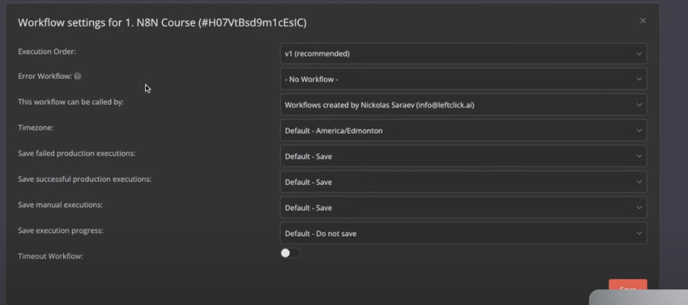

Let’s explore the **Settings** section in n8n that you’ve shared in the image. This is the "Workflow settings for 1. N8N Course (#H07VtBsd9m1ceSIc)" panel, which allows you to configure various options for your workflow. I’ll explain each setting in a beginner-friendly way, provide examples, and connect them to real-world uses. Since we’ve been discussing triggers, tags, and other workflow features, I’ll also tie these settings into the broader context of managing workflows in n8n.

---

### What is the Settings Section in n8n?

The **Settings** section in n8n is a configuration panel where you can customize how your workflow behaves, who can interact with it, and how its execution data is handled. It’s like the control room for your workflow, letting you fine-tune details that go beyond the basic steps and triggers. The settings are accessible by clicking the "Settings" option from the workflow menu (the three dots ⋮ in the editor), and they apply specifically to the workflow you’re working on.

In your image, the settings include options like **Execution Order**, **Error Workflow**, **Timezone**, and execution saving preferences. Let’s break each one down.

---

### Detailed Explanation of Each Setting

#### 1. Execution Order
- **What it is**: This determines the order in which nodes in your workflow are executed when multiple nodes are triggered simultaneously.
- **Options**: 
  - **v1 (recommended)**: The default setting, where n8n executes nodes in the order they are connected or based on a queue system to handle parallel tasks efficiently.
  - Other options (if available) might depend on your n8n version or custom configurations.
- **What it does**: It ensures that your workflow processes data in a logical sequence, especially if you have complex workflows with multiple paths or parallel executions.
- **Example**: Imagine a workflow with two triggers: "On Webhook Call" for new orders and "On a Schedule" for daily reports. If both trigger at the same time, "v1 (recommended)" ensures the order processing doesn’t interfere with the report generation.
- **Real-World Use**: An e-commerce site might use this to prioritize order processing over inventory updates during a sale, ensuring customers get confirmations first.
- **Why use it?**: It helps manage workflows with multiple steps or triggers, preventing confusion or errors in execution order.

#### 2. Error Workflow
- **What it is**: This allows you to specify another workflow that runs when the current workflow encounters an error.
- **Options**: 
  - **- No Workflow -**: No error workflow is assigned (default).
  - Workflows created by specific users (e.g., "Workflows created by Nicolas Saraev [info@leftclick.ai]").
- **What it does**: If your workflow fails (e.g., due to a connection issue or invalid data), the designated error workflow can handle the failure—e.g., sending a notification or logging the error.
- **Example**: Your workflow uses an "On Form Submission" trigger to save feedback to Google Sheets, but the Sheets API fails. An error workflow sends you an email alert with the error details.
- **Real-World Use**: A customer support team might set an error workflow to notify the IT department via Slack if a ticket-processing workflow fails.
- **Why use it?**: It provides a safety net, allowing you to respond to failures automatically rather than manually checking logs.

#### 3. This workflow can be called by
- **What it is**: This setting specifies which workflows or users can trigger the current workflow using the "Execute Workflow" node (a trigger we discussed earlier).
- **Options**: Lists workflows or users (e.g., "Workflows created by Nicolas Saraev [info@leftclick.ai]").
- **What it does**: It controls access, ensuring only authorized workflows or users can start this workflow. This is useful for security and organization.
- **Example**: You have a main workflow that processes orders and a secondary workflow that sends thank-you emails. You set the email workflow to be callable by the order-processing workflow.
- **Real-World Use**: A company might restrict a payroll workflow to be called only by an HR-approved automation to prevent unauthorized access.
- **Why use it?**: It adds a layer of control, especially in team environments or when integrating multiple workflows.

#### 4. Timezone
- **What it is**: This sets the timezone used for scheduling or time-based operations in the workflow (e.g., "On a Schedule" trigger).
- **Options**: Various timezones (e.g., "Default - America/Edmonton").
- **What it does**: It ensures that scheduled tasks run at the correct local time based on the selected timezone, avoiding confusion across regions.
- **Example**: You set a workflow to run daily at 9 AM using the "On a Schedule" trigger. With "America/Edmonton" as the timezone, it runs at 9 AM Mountain Time, not your local time if it differs.
- **Real-World Use**: A global business with teams in different timezones might set the timezone to "America/New_York" for a report generation workflow to align with headquarters.
- **Why use it?**: It prevents scheduling errors, especially for workflows that span multiple regions or need to align with a specific time.

#### 5. Save failed production executions
- **What it is**: This determines whether failed executions in a production environment are saved in n8n’s execution history.
- **Options**: 
  - **Default - Save**: Saves failed executions (default).
  - **Do not save**: Discards failed execution data.
- **What it does**: Saving failed executions lets you review what went wrong (e.g., error messages), while not saving them reduces clutter if failures are common and unimportant.
- **Example**: A workflow with an "On Webhook Call" trigger fails due to a server outage. With "Save" enabled, you can later check the execution log to diagnose the issue.
- **Real-World Use**: A developer might disable saving for a test workflow with frequent intentional failures to keep the history clean.
- **Why use it?**: It balances troubleshooting needs with performance—saving helps debugging, while not saving keeps the system lean.

#### 6. Save successful production executions
- **What it is**: This controls whether successful production executions are saved in the execution history.
- **Options**: 
  - **Default - Save**: Saves successful executions (default).
  - **Do not save**: Discards successful execution data.
- **What does it do**: Saving successful runs lets you track what worked, while not saving them reduces storage use if you only care about failures.
- **Example**: A workflow with an "On Form Submission" trigger successfully saves feedback to a database. With "Save" enabled, you can review the data flow later.
- **Real-World Use**: A marketing team might disable saving for a high-volume email campaign workflow to avoid overwhelming the execution log.
- **Why use it?**: It helps monitor performance but can be turned off to optimize storage, especially for workflows with frequent runs.

#### 7. Save manual executions
- **What it is**: This determines whether manual executions (e.g., using "Trigger Manually") are saved in the history.
- **Options**: 
  - **Default - Save**: Saves manual executions (default).
  - **Do not save**: Discards manual execution data.
- **What it does**: Saving manual runs helps you review tests or one-off tasks, while not saving them keeps the log focused on automated runs.
- **Example**: You manually trigger a workflow to test an email notification. With "Save" enabled, you can see the result in the execution history.
- **Real-World Use**: A trainer might disable saving for manual executions during a live n8n course demo to avoid cluttering the log with test runs.
- **Why use it?**: It’s useful for debugging manual tests but can be disabled to focus on automated workflow performance.

#### 8. Save execution progress
- **What it is**: This controls whether the progress of executions (e.g., which nodes have run) is saved.
- **Options**: 
  - **Default - Do not save**: Does not save execution progress (default).
  - **Save**: Saves the progress of each execution.
- **What it does**: Saving progress lets you see the step-by-step execution details, while not saving it improves performance for large workflows.
- **Example**: A workflow with multiple nodes fails midway. With "Save" enabled, you can see which node failed and why.
- **Real-World Use**: A complex data processing workflow might enable this to troubleshoot long-running tasks.
- **Why use it?**: It’s valuable for debugging complex workflows but can be turned off to reduce overhead.

#### 9. Timeout Workflow
- **What it is**: This is a toggle to enable or disable a timeout limit for the workflow.
- **Options**: On (enabled) or Off (disabled, as shown in your image).
- **What it does**: When enabled, the workflow stops if it exceeds a predefined time limit, preventing it from running indefinitely. The time limit is configurable elsewhere in n8n settings.
- **Example**: A workflow with an "On Webhook Call" trigger gets stuck due to a slow API. With timeout enabled, it stops after 5 minutes, triggering an error workflow.
- **Real-World Use**: An online store might use this to cancel order-processing workflows that take too long during peak traffic.
- **Why use it?**: It prevents resource waste and ensures workflows don’t hang, especially with unreliable external services.

---

### How Settings Tie into Triggers and Workflow Management
Let’s connect these settings to what we’ve discussed:
- **Triggers**: The "Timezone" setting affects "On a Schedule" triggers, ensuring the right time. "Error Workflow" works with any trigger if something fails.
- **Tags**: Settings like "This workflow can be called by" complement tags by controlling access, while tags organize workflows for easy finding.
- **Inactive/Share**: Settings like "Save manual executions" are useful when testing (inactive) or sharing workflows, as you can review execution history with your team.

**Example Scenario**:
- **Workflow**: A course feedback system with an "On Form Submission" trigger.
- **Settings**:
  - Execution Order: v1 (recommended) to handle multiple submissions.
  - Error Workflow: Set to a notification workflow if the form fails.
  - Timezone: America/Edmonton for the course schedule.
  - Save failed executions: Save to debug issues.
  - Timeout Workflow: Enabled to stop long hangs.
- **Real-World Use**: A trainer uses this to collect feedback during an n8n course, ensuring timely processing and error handling.

---

### Tips for Beginners
1. **Start with Defaults**: Use the default settings (e.g., "Save" for executions) until you understand your needs.
2. **Test Changes**: Adjust one setting at a time (e.g., Timeout Workflow) and test the workflow to see the effect.
3. **Document Settings**: Add notes in the workflow description (via Settings) to remember your choices.
4. **Ask for Help**: If a setting confuses you, let me know, and I can offer more examples or suggest searching for advanced guides.

---

Does this explanation of the Settings section make sense? If you’d like to explore a specific setting further or need help configuring one for a workflow, feel free to ask! 😊