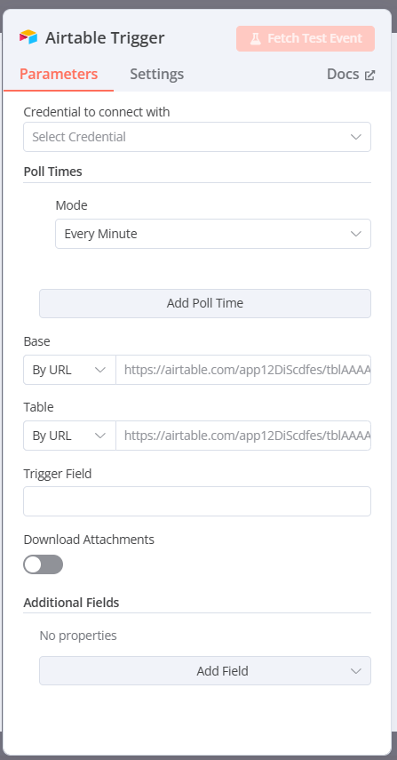

Let’s dive into the details of the **Airtable Trigger** node in n8n that you’ve shared in the image. This is a specific type of trigger (which we discussed earlier as the starting point of a workflow) that connects n8n to Airtable, a popular spreadsheet-like database tool. I’ll explain each section and option in a beginner-friendly way, provide examples, and connect it to real-world uses. Since you’re new to this, I’ll break it down step-by-step and make it relatable!

---

### What is the Airtable Trigger in n8n?

The **Airtable Trigger** is a node in n8n that starts a workflow whenever something changes in your Airtable database. It’s part of the "On App Event" trigger category we talked about earlier, where an action in an app (in this case, Airtable) kicks off the automation. This node listens for updates, new records, or other events in Airtable and passes that data to the next steps in your workflow.

Think of it like a security camera that watches your Airtable base (your database) and alerts n8n whenever something new happens, like a new entry or a change, so your workflow can react.

---

### Breakdown of the Airtable Trigger Node

The image shows the configuration panel for the Airtable Trigger node, with tabs for **Parameters**, **Settings**, and **Docs**. Let’s focus on the **Parameters** tab, which is currently active, and explain each field.

#### 1. Credential to connect with
- **What it is**: This is where you provide the login details (credentials) to connect n8n to your Airtable account.
- **Options**: A dropdown to "Select Credential" or create a new one.
- **What it does**: n8n needs permission to access your Airtable data. You’ll need an Airtable API key (a secret code) to set up the credential. This ensures only authorized workflows can interact with your Airtable base.
- **How it works**: 
  - If you haven’t set up a credential yet, click "Select Credential," then "Add Credential," and follow the prompts to enter your Airtable API key.
  - Once added, select it from the dropdown.
- **Example**: You sign into Airtable, find your API key in the account settings, and add it to n8n. Now, n8n can "see" your Airtable data.
- **Real-World Use**: A small business owner connects n8n to their Airtable base containing customer orders to automate follow-up emails.
- **Why use it?**: Without credentials, n8n can’t access Airtable, so this is the first step to make the trigger work.

#### 2. Poll Times
- **What it is**: This section controls how often n8n checks Airtable for changes.
- **Sub-options**:
  - **Mode**: A dropdown with options like "Every Minute" (default in your image).
  - **Add Poll Time**: A button to add more polling intervals if needed.
- **What it does**: n8n doesn’t get real-time updates from Airtable (like a live feed). Instead, it "polls" (checks) Airtable at set intervals. "Every Minute" means n8n checks every 60 seconds for new or updated records.
- **How it works**: 
  - The "Mode" dropdown lets you choose how often to poll (e.g., every minute, every 5 minutes, etc.).
  - You can click "Add Poll Time" to set multiple intervals if your workflow needs different check frequencies.
- **Example**: You set the mode to "Every Minute" to monitor a task list in Airtable. If a new task is added, n8n triggers the workflow within a minute.
- **Real-World Use**: A project manager uses this to check an Airtable base every 15 minutes for new project updates and sends Slack notifications to the team.
- **Why use it?**: Polling ensures n8n catches changes, but the interval affects speed (more frequent = faster but uses more resources) and cost (some platforms charge based on API calls).

#### 3. Base
- **What it is**: This specifies which Airtable base (database) n8n should monitor.
- **Options**: 
  - **By URL**: Enter the URL of your Airtable base.
- **What it does**: An Airtable base is like a folder containing your tables (e.g., "Customers," "Orders"). The URL points n8n to the right base to watch.
- **How it works**: 
  - Go to your Airtable base, copy its URL (e.g., `https://airtable.com/app12DIscfes/tblAAAA`), and paste it here.
  - The URL includes a unique app ID and table ID, which n8n uses to identify the base.
- **Example**: You paste `https://airtable.com/app12DIscfes/tblAAAA` to monitor a base called "Event Registrations."
- **Real-World Use**: An event organizer monitors a base of attendee sign-ups to trigger email confirmations.
- **Why use it?**: It tells n8n exactly where to look for changes, ensuring the trigger works on the correct data.

#### 4. Table
- **What it is**: This specifies which table within the selected base n8n should monitor.
- **Options**: 
  - **By URL**: Enter the URL of the specific table.
- **What it does**: A base can have multiple tables (like sheets in Excel). This narrows the trigger to a specific table (e.g., "Registrants" instead of the whole base).
- **How it works**: Copy the table’s URL from Airtable (e.g., `https://airtable.com/app12DIscfes/tblAAAA`) and paste it here. It’s often the same as the base URL if you’re monitoring one table.
- **Example**: You set the table to `https://airtable.com/app12DIscfes/tblAAAA` to watch the "Tasks" table for new entries.
- **Real-World Use**: A sales team monitors the "Leads" table in their Airtable base to trigger follow-up calls.
- **Why use it?**: It focuses the trigger on the exact table where changes happen, avoiding unnecessary checks.

#### 5. Trigger Field
- **What it is**: This is an optional field to specify which field in the table triggers the workflow when updated.
- **Options**: A text box to enter a field name (left blank in your image).
- **What it does**: If set, the workflow only triggers when the specified field changes (e.g., a "Status" field changes from "Pending" to "Done"). If left blank, any change in the table triggers it.
- **How it works**: Enter the name of a field in your Airtable table (e.g., "Status"). n8n then watches only that field.
- **Example**: You enter "Status" as the trigger field. The workflow runs only when the "Status" column is updated, not when other fields like "Name" change.
- **Real-World Use**: A content creator monitors the "Published" field in an Airtable table of blog posts, triggering a social media post when it’s set to "Yes."
- **Why use it?**: It makes the trigger more specific, reducing unnecessary workflow runs and saving resources.

#### 6. Download Attachments
- **What it is**: This is a toggle to decide whether n8n downloads attachments (e.g., images, files) linked in Airtable records.
- **Options**: On or Off (Off by default in your image).
- **What it does**: If enabled, n8n retrieves any attached files when a record triggers the workflow, passing them to the next nodes. If disabled, it ignores attachments.
- **How it works**: Toggle it on if your workflow needs to process files (e.g., resize images). Leave it off if attachments aren’t relevant.
- **Example**: You turn it on to download photos attached to a "Product Listings" table, then use another node to upload them to a website.
- **Real-World Use**: A photographer uses this to automatically back up client photos from an Airtable "Portfolio" table to Google Drive.
- **Why use it?**: It’s useful when attachments are part of your automation (e.g., file processing), but turning it off saves time and space if not needed.

#### 7. Additional Fields
- **What it is**: This section lets you add extra parameters to customize the trigger’s behavior.
- **Options**: 
  - "No properties" (default), with an "Add Field" button to add custom fields.
- **What it does**: You can add advanced options (e.g., filters or limits) depending on your Airtable setup or n8n version.
- **How it works**: Click "Add Field" to enter a field name and value (e.g., "Limit" = 10 to check only the last 10 records). The available fields depend on Airtable’s API.
- **Example**: You add a field "Filter" with value "Status = Active" to trigger only on active records.
- **Real-World Use**: A nonprofit filters an "Donors" table to trigger workflows only for donations over $100.
- **Why use it?**: It adds flexibility for advanced users to fine-tune the trigger based on specific needs.

#### 8. Fetch Test Event Button
- **What it is**: The pink "Fetch Test Event" button at the top.
- **What it does**: This tests the trigger by fetching a sample event from Airtable to see if the configuration works.
- **How it works**: Click it to simulate a trigger event (e.g., a new record). n8n checks the connection and returns sample data, which you can use to test the next nodes.
- **Example**: You click "Fetch Test Event" after setting the base and table. n8n pulls a sample record, and you see the data in the editor.
- **Real-World Use**: A developer tests the trigger setup before deploying a workflow to ensure it captures new Airtable entries correctly.
- **Why use it?**: It’s a quick way to verify your setup without waiting for a real change, saving time during development.

---

### How the Airtable Trigger Fits into a Workflow
The Airtable Trigger is the starting point. Once it detects a change (e.g., a new record), it passes the data to the next node in your workflow. For example:
- **Workflow**: 
  - **Trigger**: Airtable Trigger watches the "Orders" table.
  - **Next Node**: Email node sends a confirmation to the customer using the order details.
- **Connection to Settings**: The "Timeout Workflow" setting (from the workflow settings) could stop the workflow if the Airtable API is slow.

---

### Example Workflow with Airtable Trigger
**Scenario**: You run a small online store and use Airtable to track orders.
- **Setup**:
  - **Credential**: Connect with your Airtable API key.
  - **Poll Times**: Set to "Every 5 Minutes" to check for new orders.
  - **Base**: `https://airtable.com/app12DIscfes/tblAAAA` (your "Orders" base).
  - **Table**: `https://airtable.com/app12DIscfes/tblAAAA` (the "Orders" table).
  - **Trigger Field**: "Order Status" (triggers when status changes to "Placed").
  - **Download Attachments**: Off (no files in orders).
  - **Additional Fields**: Add "Limit" = 5 to check only the last 5 orders.
- **Action**: When a new order is placed, n8n triggers a workflow to send a thank-you email.
- **Real-World Use**: During a sale, this automates order confirmations, saving you time.

---

### Real-World Use Case
**Business Example**: A freelance graphic designer uses Airtable to manage client projects.
- **Trigger Setup**:
  - Base: "Client Projects" base.
  - Table: "Tasks" table.
  - Poll Times: "Every Minute."
  - Trigger Field: "Completed" (triggers when set to "Yes").
- **Workflow**: When a task is marked completed, n8n sends a Slack message to the client and emails an invoice.
- **Benefit**: Automates communication and billing, improving efficiency.

---

### Tips for Beginners
1. **Start Simple**: Begin with "Every Minute" polling and one table to avoid overwhelm.
2. **Test Often**: Use "Fetch Test Event" after each change to ensure it works.
3. **Secure Credentials**: Keep your API key safe and don’t share it.
4. **Experiment**: Try different trigger fields to see what fits your needs.

---

Does this deep dive into the Airtable Trigger make sense? If you’d like help setting up a specific workflow or need clarification on any part, let me know! 😊 I can also guide you through testing it if you’re ready to try!