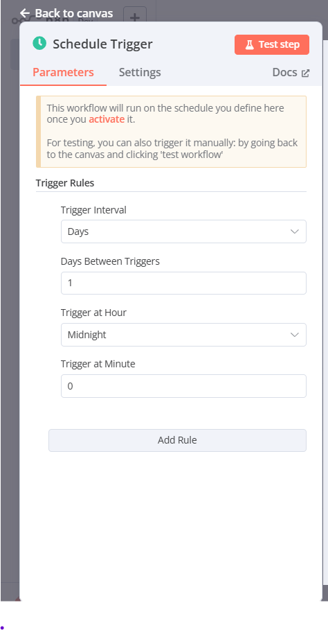

Let’s explore the **Schedule Trigger** node in n8n that you’ve shared in the image. This is another type of trigger we discussed earlier, falling under the "On a Schedule" category, where the workflow starts based on a predefined time or interval. I’ll explain each part of the configuration in a beginner-friendly way, provide examples, and connect it to real-world scenarios. Since you’re new to this, I’ll break it down step-by-step and keep it relatable!

---

### What is the Schedule Trigger in n8n?

The **Schedule Trigger** is a node in n8n that starts a workflow at specific times or on a recurring schedule that you define. It’s like setting an alarm clock for your automation tasks. Instead of waiting for an app event (like the Airtable Trigger) or a manual action, this trigger runs automatically based on the schedule you set, such as daily, weekly, or at a custom interval.

Think of it as a reminder system that tells n8n, “Hey, it’s time to run this workflow!” once the conditions you set are met.

---

### Breakdown of the Schedule Trigger Node

The image shows the configuration panel for the Schedule Trigger node, with tabs for **Parameters**, **Settings**, and **Docs**. The **Parameters** tab is active, and it includes a section for **Trigger Rules**. Let’s dive into each component.

#### 1. General Information
- **Text at the Top**: 
  - "This workflow will run on the schedule you define here once you activate it."
  - "For testing, you can also trigger it manually by going back to the canvas and clicking ‘test workflow’."
- **What it means**: 
  - The workflow won’t start until you save and activate it (using the "Inactive" toggle we discussed earlier).
  - For testing, you can manually run it from the main editor (canvas) by clicking the "test workflow" button, which bypasses the schedule.
- **Example**: You set a schedule to run at midnight but want to test it now. You click "test workflow" to see if it works without waiting.
- **Real-World Use**: A marketer tests a daily email campaign workflow before letting it run on its scheduled time.
- **Why it’s useful**: It gives you flexibility to test without waiting for the schedule and ensures the workflow only runs when activated.

#### 2. Trigger Rules
This section defines when and how often the workflow runs. It includes several fields to customize the schedule.

- **Trigger Interval**
  - **What it is**: This sets the frequency of the schedule (e.g., daily, weekly).
  - **Options**: Dropdown with choices like "Days" (selected in your image), "Hours," "Minutes," etc.
  - **What it does**: It determines the time unit for the recurring schedule. "Days" means the workflow runs every few days.
  - **Example**: With "Days" selected, the workflow might run every 1 day (daily) or every 7 days (weekly), depending on the next field.
  - **Real-World Use**: A business sets "Days" to run a weekly sales report every Monday.
  - **Why use it?**: It lets you choose the right time frame (days, hours, minutes) based on your needs.

- **Days Between Triggers**
  - **What it is**: This specifies how many days to wait between each trigger.
  - **Options**: A number field (set to "1" in your image).
  - **What it does**: It sets the interval within the chosen trigger interval. With "Days" and "1," the workflow runs every day.
  - **Example**: If you set "Days Between Triggers" to "1," the workflow runs daily at the specified time. If set to "7," it runs weekly.
  - **Real-World Use**: A content creator sets "1" to post a blog update daily or "30" for a monthly newsletter.
  - **Why use it?**: It fine-tunes the frequency, giving you control over how often the workflow executes.

- **Trigger at Hour**
  - **What it is**: This sets the hour of the day when the workflow runs.
  - **Options**: Dropdown with times like "Midnight" (selected in your image), "1 AM," "2 AM," etc.
  - **What it does**: It pins the schedule to a specific hour. "Midnight" means 12:00 AM.
  - **Example**: With "Midnight" selected, the workflow runs every day at 12:00 AM.
  - **Real-World Use**: A data analyst schedules a report to generate at "9 AM" when the team starts work.
  - **Why use it?**: It ensures the workflow runs at a convenient or strategic time (e.g., after business hours).

- **Trigger at Minute**
  - **What it is**: This sets the minute past the hour when the workflow runs.
  - **Options**: A number field (set to "0" in your image, meaning the start of the hour).
  - **What it does**: It adds precision to the hour. "0" means it runs exactly at the hour (e.g., 12:00 AM), while "30" would mean 12:30 AM.
  - **Example**: With "Trigger at Hour" as "Midnight" and "Trigger at Minute" as "0," the workflow runs at 12:00 AM daily.
  - **Real-World Use**: A backup workflow runs at "2:15 AM" (Hour: 2 AM, Minute: 15) to avoid peak usage times.
  - **Why use it?**: It allows exact timing, which is useful for aligning with specific events or avoiding busy periods.

- **Add Rule**
  - **What it is**: A button to add more scheduling rules.
  - **What it does**: Clicking "Add Rule" lets you create additional schedules (e.g., run daily at 9 AM and weekly on Mondays at 6 PM).
  - **How it works**: Each new rule adds another set of "Trigger Interval," "Days Between Triggers," "Trigger at Hour," and "Trigger at Minute" fields.
  - **Example**: You add a rule to run daily at 8 AM and another to run weekly on Fridays at 5 PM.
  - **Real-World Use**: A retailer schedules inventory checks daily at midnight and a summary report weekly on Sunday at 10 AM.
  - **Why use it?**: It supports complex schedules with multiple run times, catering to varied business needs.

---

### How the Schedule Trigger Fits into a Workflow
The Schedule Trigger starts the workflow at the defined times, passing any relevant data (e.g., the current date) to the next nodes. For example:
- **Workflow**:
  - **Trigger**: Schedule Trigger runs daily at midnight.
  - **Next Node**: Google Sheets node updates a sales summary with the previous day’s data.
- **Connection to Settings**: The "Timezone" setting (from workflow settings) ensures the midnight trigger aligns with your local time (e.g., America/Edmonton).

---

### Example Workflow with Schedule Trigger
**Scenario**: You’re a freelancer managing tasks and want to send a daily reminder.
- **Setup**:
  - **Trigger Interval**: Days.
  - **Days Between Triggers**: 1 (runs every day).
  - **Trigger at Hour**: 8 AM.
  - **Trigger at Minute**: 0 (runs at 8:00 AM).
- **Action**: The workflow sends an email reminding you to check your task list.
- **Real-World Use**: Every morning at 8:00 AM, you get an email to review your day’s priorities, keeping you on track.

**Complex Example**:
- **Setup**:
  - Rule 1: Days, 1, 9 AM, 0 (daily at 9:00 AM).
  - Rule 2: Days, 7, 6 PM, 0 (weekly on the same day at 6:00 PM).
- **Action**: Daily, it checks email; weekly, it generates an invoice.
- **Real-World Use**: A consultant automates daily client follow-ups and weekly billing.

---

### Real-World Use Case
**Business Example**: A small online store owner uses n8n to manage inventory.
- **Trigger Setup**:
  - Trigger Interval: Days.
  - Days Between Triggers: 1.
  - Trigger at Hour: Midnight.
  - Trigger at Minute: 0.
- **Workflow**: At midnight, n8n checks the inventory in Airtable, reorders low-stock items via an email to the supplier, and updates a Google Sheet.
- **Benefit**: Automates overnight inventory management, saving time and ensuring stock levels are maintained.

---

### Tips for Beginners
1. **Start Simple**: Begin with one rule (e.g., daily at midnight) to get comfortable.
2. **Test Manually**: Use the "test workflow" option to check your setup before activating.
3. **Check Timezone**: Ensure the workflow settings’ timezone matches your schedule (e.g., America/Edmonton).
4. **Add Rules Gradually**: Add more rules only after mastering a single schedule.

---

### How It Connects to Previous Concepts
- **Triggers**: This is an "On a Schedule" trigger, complementing others like "Airtable Trigger."
- **Inactive Toggle**: You’ll need to activate the workflow for the schedule to work.
- **Settings**: The "Timeout Workflow" setting can stop the schedule if it runs too long.

Does this explanation of the Schedule Trigger make sense? If you’d like help setting up a specific schedule or need more examples, let me know! 😊 I can also guide you through testing it if you’re ready to try!