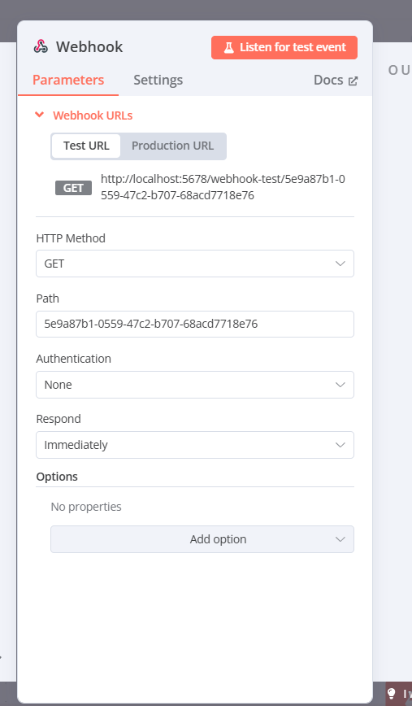

Let’s dive into the **Webhook** node in n8n that you’ve shared in the image. This is a specific type of trigger we discussed earlier, falling under the "On Webhook Call" category, where the workflow starts when an external system sends an HTTP request to n8n. I’ll explain each part of the configuration in a beginner-friendly way, provide examples, and connect it to real-world scenarios. Since you’re new to this, I’ll break it down step-by-step and make it relatable!

---

### What is the Webhook Trigger in n8n?

The **Webhook** node in n8n is a trigger that starts a workflow when an external application or system sends an HTTP request (like a message) to a specific URL provided by n8n. Think of a webhook as a doorbell: when someone (an external app) presses the doorbell (sends a request to the URL), n8n hears it and starts the workflow. This is a powerful way to connect n8n with other apps, websites, or services that support webhooks.

In simpler terms, it’s like giving someone your phone number and saying, “Call me when something happens, and I’ll take action.” Here, the “phone number” is the webhook URL, and “something happens” could be a new order, a form submission, or any event in another app.

---

### Breakdown of the Webhook Node

The image shows the configuration panel for the Webhook node, with tabs for **Parameters**, **Settings**, and **Docs**. The **Parameters** tab is active, and it includes fields like Webhook URLs, HTTP Method, Path, Authentication, Respond, and Options. Let’s break down each component.

#### 1. Webhook URLs
- **What it is**: This section shows the URLs that external apps can use to trigger the workflow.
- **Sub-options**:
  - **Test URL**: `http://localhost:5678/webhook-test/5e9a87b1-0559-472c-b707-68acd7718e76`
  - **Production URL**: `http://localhost:5678/webhook/5e9a87b1-0559-472c-b707-68acd7718e76`
- **What it does**: 
  - **Test URL**: Used for testing the webhook while you’re building the workflow. It only works when the workflow is active and you’re in test mode.
  - **Production URL**: Used when the workflow is saved and activated for real-world use (not just testing).
- **How it works**: 
  - n8n generates these unique URLs when you add the Webhook node. You share the appropriate URL (Test or Production) with the external app.
  - When the app sends a request to this URL, the workflow starts.
- **Example**: You’re building an online store. You copy the Test URL and use it in a form tool (like Google Forms) to send data to n8n when someone submits the form. Once tested, you switch to the Production URL for live use.
- **Real-World Use**: A developer uses the Production URL to connect a website checkout system to n8n, triggering a workflow for order processing.
- **Why use it?**: These URLs are the entry points for external apps to communicate with your workflow, making it possible to automate actions based on external events.

#### 2. HTTP Method
- **What it is**: This specifies the type of HTTP request the webhook will respond to.
- **Options**: Dropdown with choices like "GET" (selected in your image), "POST," "PUT," "DELETE," etc.
- **What it does**: 
  - HTTP methods are like different ways of sending a message. 
  - **GET** is typically used to retrieve data (e.g., a simple ping or check).
  - **POST** is used to send data (e.g., form submissions or order details).
  - The webhook only triggers if the incoming request matches the selected method.
- **How it works**: 
  - If you set it to "GET," the webhook triggers when an app sends a GET request to the URL.
  - If the app sends a POST request instead, the webhook won’t trigger (unless you change the method to POST).
- **Example**: You set the HTTP Method to "POST" for a webhook that receives new customer orders from your website. When the website sends a POST request with order details, the workflow starts.
- **Real-World Use**: An e-commerce platform sends a POST request with order data to n8n, triggering a workflow to update inventory.
- **Why use it?**: It ensures the webhook only responds to the right type of request, making your workflow secure and efficient.

#### 3. Path
- **What it is**: This is the unique part of the webhook URL that identifies this specific webhook.
- **Value**: `5e9a87b1-0559-472c-b707-68acd7718e76` (a random string in your image).
- **What it does**: It’s a unique identifier appended to the webhook URL (e.g., `/webhook/5e9a87b1-0559-472c-b707-68acd7718e76`). It ensures multiple webhooks on the same n8n instance don’t conflict.
- **How it works**: 
  - n8n automatically generates this path when you add the Webhook node.
  - You can’t edit it directly, but it’s part of the URL you share with the external app.
- **Example**: If you have two webhooks—one for orders and one for feedback—the paths ensure they’re distinct (e.g., `/webhook/123` vs. `/webhook/456`).
- **Real-World Use**: A company uses multiple webhooks for different departments (sales, support) without overlap.
- **Why use it?**: It keeps your webhooks organized and prevents mix-ups between workflows.

#### 4. Authentication
- **What it is**: This determines if the webhook requires authentication to accept requests.
- **Options**: Dropdown with choices like "None" (selected in your image), "Basic Auth," or "Header Auth."
- **What it does**: 
  - **None**: Anyone with the URL can trigger the webhook (no security).
  - **Basic Auth**: Requires a username and password in the request.
  - **Header Auth**: Requires a specific key in the request headers.
- **How it works**: 
  - With "None," the webhook is open to any request sent to the URL.
  - With authentication enabled, the external app must include the correct credentials to trigger the workflow.
- **Example**: You set Authentication to "None" for a simple test webhook. Later, for a production webhook handling sensitive data (e.g., payments), you set it to "Basic Auth" to secure it.
- **Real-World Use**: A financial app uses "Header Auth" to ensure only authorized requests from their server can trigger a payment workflow.
- **Why use it?**: It adds security, ensuring only trusted apps can trigger your workflow, especially for sensitive tasks.

#### 5. Respond
- **What it is**: This controls how the webhook responds to the app that sent the request.
- **Options**: Dropdown with choices like "Immediately" (selected in your image), "When Last Node Finishes," or "Using ‘Respond to Webhook’ Node."
- **What it does**: 
  - **Immediately**: n8n sends a response (e.g., “Request received”) as soon as the webhook is triggered, without waiting for the workflow to finish.
  - **When Last Node Finishes**: n8n waits until the entire workflow completes, then sends a response.
  - **Using ‘Respond to Webhook’ Node**: You manually define the response later in the workflow using a specific node.
- **How it works**: 
  - With "Immediately," the external app gets a quick confirmation, and the workflow runs in the background.
  - Other options allow for more customized responses based on the workflow’s outcome.
- **Example**: A website sends a POST request with a new order. With "Immediately" selected, n8n responds with “Order received” right away, then processes the order in the background.
- **Real-World Use**: A form submission system gets an instant “Thank you” response, improving user experience, while n8n processes the data.
- **Why use it?**: It ensures the external app knows the request was received, which is important for user experience and system reliability.

#### 6. Options
- **What it is**: This section lets you add extra parameters to customize the webhook’s behavior.
- **Options**: 
  - "No properties" (default), with an "Add Option" button.
- **What it does**: You can add advanced settings, like custom headers or query parameters, to fine-tune how the webhook works.
- **How it works**: Click "Add Option" to add fields like "Allowed Origins" (to restrict which domains can send requests) or "Response Code" (e.g., 200 for success).
- **Example**: You add an option to allow only requests from `yourwebsite.com` for security.
- **Real-World Use**: A developer restricts a webhook to accept requests only from their app’s domain, preventing unauthorized access.
- **Why use it?**: It provides flexibility for advanced users to secure or customize the webhook.

#### 7. Listen for Test Event Button
- **What it is**: The red "Listen for test event" button at the top.
- **What it does**: This puts n8n in listening mode, waiting for a test request to the Test URL to verify the webhook setup.
- **How it works**: 
  - Click "Listen for test event," then send a request to the Test URL (e.g., using a tool like Postman or a browser).
  - n8n captures the request and shows the data in the editor, letting you test the workflow.
- **Example**: You open a browser, paste the Test URL, and hit Enter (since it’s a GET request). n8n triggers the workflow and shows the request data.
- **Real-World Use**: A developer tests a webhook by sending a fake order request to ensure the workflow processes it correctly.
- **Why use it?**: It lets you confirm the webhook is set up correctly without waiting for a real event.

---

### How the Webhook Trigger Fits into a Workflow
The Webhook Trigger starts the workflow when it receives an HTTP request, passing the request data (e.g., form fields, order details) to the next nodes. For example:
- **Workflow**:
  - **Trigger**: Webhook Trigger with HTTP Method "POST."
  - **Next Node**: Google Sheets node adds the request data to a spreadsheet.
- **Connection to Settings**: The "Timeout Workflow" setting can stop the workflow if the external app’s request takes too long.

---

### Example Workflow with Webhook Trigger
**Scenario**: You run a small website with a contact form.
- **Setup**:
  - **Webhook URLs**: Use the Production URL after testing.
  - **HTTP Method**: POST (since forms typically send POST requests).
  - **Path**: Automatically generated (e.g., `5e9a87b1-0559-472c-b707-68acd7718e76`).
  - **Authentication**: None (for simplicity during testing).
  - **Respond**: Immediately (to confirm receipt to the website).
- **Action**: When someone submits the form, the website sends a POST request to the Production URL. The workflow saves the form data to Airtable.
- **Real-World Use**: Automates customer inquiries by logging them in Airtable for follow-up.

**Complex Example**:
- **Setup**:
  - HTTP Method: POST.
  - Authentication: Basic Auth (to secure it).
  - Respond: When Last Node Finishes (to confirm processing).
- **Action**: An e-commerce platform sends order data, and the workflow updates inventory, sends a confirmation email, and responds with “Order processed.”
- **Real-World Use**: Streamlines order processing during a sale.

---

### Real-World Use Case
**Business Example**: A small online store uses a webhook to process orders.
- **Trigger Setup**:
  - HTTP Method: POST.
  - Authentication: Header Auth (to secure it).
  - Respond: Immediately.
- **Workflow**: When the website sends a POST request with order details, n8n updates inventory in Airtable, sends a confirmation email, and notifies the team via Slack.
- **Benefit**: Automates order handling, saving time and reducing errors.

---

### Tips for Beginners
1. **Start with Test URL**: Use the Test URL to experiment before going live with the Production URL.
2. **Match HTTP Method**: Ensure the external app’s request matches the HTTP Method (e.g., POST for forms).
3. **Secure It**: Use Authentication for production to prevent unauthorized access.
4. **Test Thoroughly**: Use "Listen for test event" to confirm the setup works.

---

### How It Connects to Previous Concepts
- **Triggers**: This is an "On Webhook Call" trigger, complementing others like "Airtable Trigger" and "Schedule Trigger."
- **Inactive Toggle**: The webhook only works when the workflow is active.
- **Settings**: The "Timezone" setting doesn’t affect webhooks, but "Error Workflow" can handle failures if the request fails.

Does this explanation of the Webhook Trigger make sense? If you’d like help setting up a specific webhook or need more examples, let me know! 😊 I can also guide you through testing it if you’re ready to try!