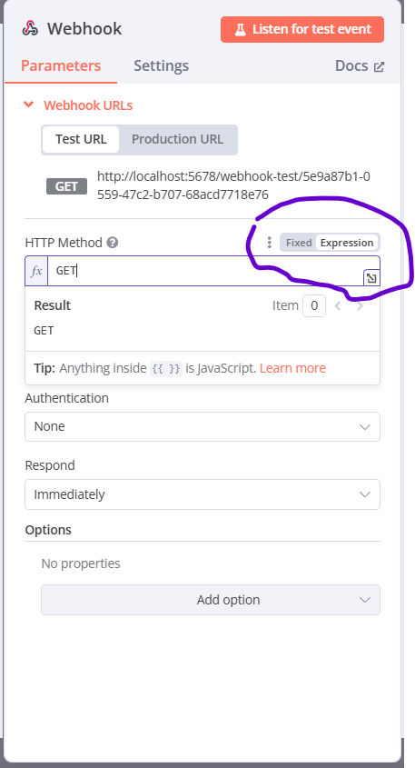

Let’s dive into the concept of **Expressions** in the context of the **Webhook** node in n8n, which you’ve highlighted with a purple marker in the image. Since you’re a beginner, I’ll explain this in a simple and detailed way, connect it to the Webhook node’s configuration, provide examples, and show real-world uses. This builds on our previous discussions about triggers, so I’ll tie it in where relevant!

---

### What is an Expression in n8n?

An **Expression** in n8n is a way to dynamically set values in a node using JavaScript code or pre-built variables, instead of hardcoding static values (like "GET" or a fixed number). It’s like a smart formula that calculates or retrieves a value based on data, conditions, or logic, making your workflows more flexible and powerful.

In the Webhook node, the **HTTP Method** field (highlighted in your image) allows you to use an expression to determine the HTTP method dynamically. This is indicated by the `{x}` icon next to the field, which toggles between "Fixed" (a static value) and "Expression" (a dynamic value).

- **Fixed**: You manually enter a value (e.g., "GET"), and it stays the same every time.
- **Expression**: You write a small piece of JavaScript or use n8n variables, and the value changes based on the context (e.g., the incoming data or workflow state).

The tip in the image, “Anything inside `{{ }}` is JavaScript. Learn more,” hints that expressions use JavaScript syntax within double curly braces `{{ }}`.

---

### Breakdown of the Expression in the Webhook Node

Let’s look at the specific example in your image, where the **HTTP Method** is set to an expression:

#### 1. Switching to Expression Mode
- **What it is**: The `{x}` icon next to the HTTP Method field lets you switch between "Fixed" and "Expression" modes.
- **How it works**: 
  - Click the `{x}` icon to toggle to "Expression."
  - The field changes to show a dropdown with "Fixed" and "Expression," and the input box allows JavaScript code.
- **Current State**: In your image, it’s set to "Expression," and the value is `item 0`.

#### 2. Expression Input: `item 0`
- **What it is**: The expression `item 0` is entered in the field.
- **What it does**: 
  - In n8n, `item` refers to the data passed from the previous step or the incoming webhook request.
  - `item 0` specifically accesses the first item (record) in the data array. For a webhook, this is typically the data sent in the HTTP request (e.g., form fields or JSON data).
  - However, `item 0` by itself isn’t a valid HTTP method (like "GET" or "POST"). It seems incomplete or intended as a placeholder/example. To be functional, it would need to reference a specific property or logic (e.g., `item 0.method` or a conditional statement).
- **How it works**: 
  - When a webhook request arrives, n8n evaluates the expression.
  - The result of the expression becomes the HTTP method used for that request.
- **Example**: If the incoming webhook data is `{ "method": "POST" }` and the expression is `item 0.method`, the HTTP method would be set to "POST" dynamically based on the request data.
- **Real-World Use**: A multi-purpose webhook could switch between "GET" and "POST" based on a parameter in the request, like a command from a website.

#### 3. Result Dropdown
- **What it is**: The dropdown next to the expression input, showing "item 0" as the result.
- **What it does**: This displays the current value or output of the expression. Since `item 0` alone isn’t a method, it might show an error or the raw data (e.g., the entire first item) until properly defined.
- **How it works**: n8n evaluates the expression in real-time as you type or when the workflow runs, updating the "Result" to reflect the outcome.
- **Example**: If you change the expression to `item 0.httpMethod` (assuming the request includes a `httpMethod` field), the Result might show "POST" if that’s the value sent.
- **Real-World Use**: A developer tests different expressions to ensure the correct method is extracted from the request.

#### 4. Tip: “Anything inside {{ }} is JavaScript. Learn more”
- **What it means**: This reminds you that expressions use JavaScript syntax within `{{ }}`. You can write custom logic, access variables, or manipulate data.
- **Examples of JavaScript in Expressions**:
  - `{{ 1 + 1 }}` returns `2`.
  - `{{ item 0.name }}` returns the "name" field from the first item.
  - `{{ item 0.method === 'GET' ? 'GET' : 'POST' }}` returns "GET" if the method is "GET," otherwise "POST" (a conditional).
- **How it works**: n8n executes the JavaScript when the workflow runs, replacing the expression with its result.
- **Real-World Use**: A workflow switches the HTTP method based on the time of day (e.g., `{{ new Date().getHours() > 12 ? 'POST' : 'GET' }}`).

---

### Why Use Expressions in the HTTP Method?
Using an expression for the HTTP Method allows the webhook to adapt dynamically:
- **Flexibility**: The method can change based on the incoming request or workflow conditions.
- **Automation**: No need to manually update the node for different scenarios.
- **Complexity**: Handles advanced cases where the method depends on data (e.g., a command in the request).

However, in your image, `item 0` alone won’t work as an HTTP method because it’s not a valid value (e.g., "GET," "POST"). It likely needs to reference a specific property or include logic. Let’s fix it with examples.

---

### Examples of Expressions for HTTP Method

1. **Static Method with Expression**:
   - **Expression**: `{{ 'GET' }}`
   - **Result**: Always "GET," equivalent to a fixed value but written as an expression.
   - **Use Case**: Test the webhook with a consistent method.

2. **Dynamic Method from Request**:
   - **Expression**: `{{ item 0.method }}`
   - **Assumption**: The webhook request includes a JSON body like `{ "method": "POST" }`.
   - **Result**: "POST" if the request data has `method: "POST"`.
   - **Use Case**: A website sends a command (e.g., "POST" or "GET"), and n8n adjusts accordingly.

3. **Conditional Method**:
   - **Expression**: `{{ item 0.action === 'create' ? 'POST' : 'GET' }}`
   - **Assumption**: The request includes an `action` field (e.g., `{ "action": "create" }`).
   - **Result**: "POST" if `action` is "create," otherwise "GET."
   - **Use Case**: A form submission uses "POST" for new entries and "GET" for queries.

4. **Default Method with Fallback**:
   - **Expression**: `{{ item 0.customMethod || 'GET' }}`
   - **Assumption**: The request might include a `customMethod` field, or it defaults to "GET."
   - **Result**: Uses `customMethod` if present, otherwise "GET."
   - **Use Case**: A flexible webhook handles different app integrations.

---

### How to Use Expressions Correctly
1. **Access Data**: Use `item 0.property` to get a specific field from the webhook request (e.g., `item 0.name` for a "name" field).
2. **Write Logic**: Use JavaScript conditionals (e.g., `?:`) or functions (e.g., `toUpperCase()`).
3. **Test It**: Click "Listen for test event," send a request with sample data (e.g., `{ "method": "POST" }` using Postman), and check the result.
4. **Debug**: If the result is unexpected (e.g., "item 0"), refine the expression to target the right data.

---

### Real-World Use Case with Expressions
**Scenario**: A small business website sends order data to n8n via a webhook.
- **Setup**:
  - **Webhook URLs**: Production URL shared with the website.
  - **HTTP Method**: Expression `{{ item 0.type === 'new' ? 'POST' : 'GET' }}`.
  - **Assumption**: The request includes `{ "type": "new", "order": "123" }` for new orders or `{ "type": "check", "order": "123" }` for status checks.
  - **Respond**: Immediately.
- **Workflow**: 
  - If "type" is "new," a POST request triggers an order creation in Airtable.
  - If "type" is "check," a GET request triggers a status lookup.
- **Benefit**: One webhook handles multiple actions dynamically, reducing the need for multiple nodes.

---

### Connecting to Previous Concepts
- **Triggers**: This is an "On Webhook Call" trigger, enhanced by expressions for dynamic behavior.
- **Settings**: The "Error Workflow" setting can handle cases where the expression fails (e.g., missing data).
- **Other Nodes**: Expressions are used across n8n (e.g., in the Airtable Trigger or Schedule Trigger) to customize values.

---

### Tips for Beginners
1. **Start Simple**: Begin with a static expression like `{{ 'GET' }}` to understand it.
2. **Check Data**: Use the "Listen for test event" button to see the `item 0` data structure, then build your expression.
3. **Learn Basics**: Explore JavaScript basics (e.g., `if`, `? :`) for more complex expressions.
4. **Ask for Help**: If stuck, let me know, and I can suggest a specific expression or offer to search for guides!

---

### Fixing the Current Expression
In your image, `item 0` alone won’t work as an HTTP method. Here’s a suggestion:
- **Revised Expression**: `{{ item 0.httpMethod || 'GET' }}`
- **Explanation**: Uses `item 0.httpMethod` if it exists in the request, defaulting to "GET" if not.
- **Test It**: Send a request with `{ "httpMethod": "POST" }` and check if the Result updates to "POST."

Does this explanation of expressions make sense? If you’d like help crafting a specific expression or testing it, let me know! 😊 I can guide you step-by-step!