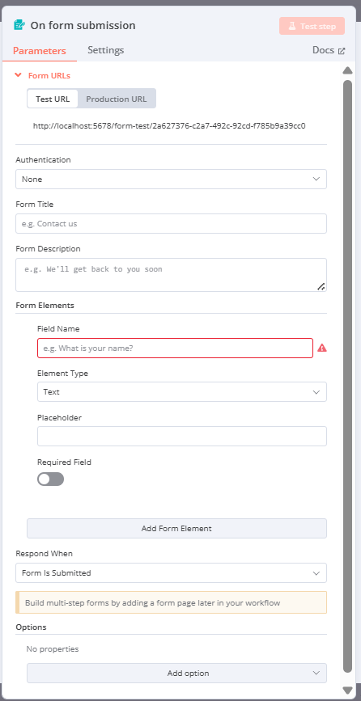

Let’s dive into the **On Form Submission** trigger node in n8n, as shown in your image. This is a specific type of trigger we discussed earlier, falling under the "On Form Submission" category, where the workflow starts when someone submits a form created by n8n. I’ll break this down in a beginner-friendly way, explain each part in detail, provide examples, and include real-world use cases. To make it engaging, I’ll use headings with icons and structure the content clearly!

---

## 🚀 Understanding the On Form Submission Trigger in n8n

The **On Form Submission** trigger in n8n allows you to create a simple web form directly within n8n, share it with others, and start a workflow whenever someone submits the form. It’s like setting up a suggestion box: you create a form, give people the link to fill it out, and when they submit it, n8n takes the information and does something with it—like saving it to a database or sending you an email.

This trigger is perfect for collecting data from users (e.g., feedback, registrations, or orders) and automating what happens next without needing a separate form-building tool.

---

## 🧩 Breakdown of the On Form Submission Trigger Node

The image shows the configuration panel for the On Form Submission node, with tabs for **Parameters**, **Settings**, and **Docs**. The **Parameters** tab is active, and it includes fields like Form URLs, Authentication, Form Title, Form Description, Form Elements, Respond When, and Options. Let’s break each part down step-by-step.

### 🎯 1. Form URLs
- **What it is**: This section shows the URLs where users can access the form.
- **Sub-options**:
  - **Test URL**: `http://localhost:5678/form-test/2a627376-c247-492c-92cd-f785b9a39cC0`
  - **Production URL**: Not shown (would appear after saving and activating the workflow).
- **What it does**:
  - **Test URL**: Used while testing the form. You can share this link to test the form without making it live.
  - **Production URL**: Used for the live form after the workflow is saved and activated.
- **How it works**:
  - n8n generates these URLs automatically when you add the On Form Submission node.
  - Share the Test URL with yourself or a small group to try it out, then switch to the Production URL for real users.
- **Example**: You create a feedback form and copy the Test URL. You open it in a browser, fill it out, and submit it to see if the workflow runs.
- **Real-World Use**: A small business shares the Production URL on their website for customers to submit inquiries.
- **Why use it?**: These URLs are the links users visit to access your form, making it easy to collect data.

### 🔒 2. Authentication
- **What it is**: This determines if users need to log in or provide credentials to access the form.
- **Options**: Dropdown with choices like "None" (selected in your image), "Basic Auth," or "Header Auth."
- **What it does**:
  - **None**: Anyone with the URL can access and submit the form (no security).
  - **Basic Auth**: Requires a username and password to access the form.
  - **Header Auth**: Requires a specific key in the request headers (advanced).
- **How it works**:
  - With "None," the form is open to everyone.
  - With authentication enabled, only authorized users can access the form.
- **Example**: You set Authentication to "None" for a public feedback form. For an internal employee survey, you might use "Basic Auth" to restrict access.
- **Real-World Use**: A company uses "Basic Auth" for an employee feedback form to ensure only staff can submit responses.
- **Why use it?**: It adds security, protecting the form from unauthorized access when needed.

### 📝 3. Form Title
- **What it is**: This is the title displayed at the top of your form.
- **Value**: Left blank in your image.
- **What it does**: It gives the form a name or heading, helping users understand its purpose.
- **How it works**: Enter a title (e.g., "Customer Feedback Form"), and it appears on the form page when users visit the URL.
- **Example**: You set the title to "Event Registration." When users open the form, they see "Event Registration" at the top.
- **Real-World Use**: An event organizer uses "Event Registration Form" to make the purpose clear to attendees.
- **Why use it?**: It provides context, making the form user-friendly and professional.

### 📖 4. Form Description
- **What it is**: This is a brief description or instruction shown below the title on the form.
- **Value**: "e.g. We'll get back to you soon" (a placeholder in your image).
- **What it does**: It gives users additional information or guidance about the form.
- **How it works**: Enter a description (e.g., "Please provide your feedback on our service"), and it appears on the form.
- **Example**: You set the description to "Please fill out your details below." Users see this instruction when they open the form.
- **Real-World Use**: A nonprofit uses "Share your thoughts on our recent fundraiser" to guide respondents.
- **Why use it?**: It helps users understand what to do, improving the form’s usability.

### 🖥️ 5. Form Elements
- **What it is**: This section defines the fields (questions) on your form.
- **Sub-options**:
  - **Field Name**: "e.g. What is your name?" (a placeholder in your image, with a warning icon indicating it needs a valid name).
  - **Element Type**: Dropdown with "Text" (selected in your image), "Email," "Number," etc.
  - **Placeholder**: A text field (blank in your image).
  - **Required Field**: A toggle (Off by default in your image).
  - **Add Form Element**: A button to add more fields.
- **What it does**:
  - **Field Name**: The label or question for the field (e.g., "Name").
  - **Element Type**: The type of input (e.g., "Text" for free text, "Email" for email addresses).
  - **Placeholder**: A hint shown in the field (e.g., "Enter your name here").
  - **Required Field**: If toggled On, users must fill this field to submit the form.
- **How it works**:
  - Define each field to build the form. In your image, there’s one field with a placeholder name ("e.g. What is your name?"), which needs to be replaced with a proper name like "Name."
  - The warning icon indicates the field name isn’t valid yet—it should be a short identifier (e.g., "Name"), not a full question.
  - Click "Add Form Element" to add more fields (e.g., "Email," "Comments").
- **Example**:
  - Field Name: "Name," Element Type: "Text," Placeholder: "Enter your name," Required: On.
  - Field Name: "Email," Element Type: "Email," Placeholder: "Enter your email," Required: On.
  - Users see a form with "Name" and "Email" fields, and they must fill both to submit.
- **Real-World Use**: A teacher creates a form with fields "Student Name" (Text), "Grade" (Number), and "Comments" (Text) to collect homework submissions.
- **Why use it?**: It lets you customize the form to collect exactly the data you need.

### ⏳ 6. Respond When
- **What it is**: This controls when n8n responds to the user after form submission.
- **Options**: Dropdown with choices like "Form is Submitted" (selected in your image), "When Last Node Finishes," or "Using ‘Respond to Webhook’ Node."
- **What it does**:
  - **Form is Submitted**: n8n sends a response (e.g., “Thank you!”) as soon as the form is submitted.
  - **When Last Node Finishes**: Waits until the entire workflow completes, then sends a response.
  - **Using ‘Respond to Webhook’ Node**: You define the response later in the workflow.
- **How it works**:
  - With "Form is Submitted," users see a confirmation immediately, and the workflow runs in the background.
  - Other options allow for custom responses based on the workflow’s outcome.
- **Example**: A user submits a feedback form. With "Form is Submitted," they see “Thank you for your feedback!” right away, while n8n saves the data to Airtable.
- **Real-World Use**: A customer support form shows “We’ve received your request” immediately, improving user experience.
- **Why use it?**: It ensures users get feedback, making the form interactive and user-friendly.

### 🔧 7. Options
- **What it is**: This section lets you add extra parameters to customize the form’s behavior.
- **Options**: "No properties" (default), with an "Add Option" button.
- **What it does**: You can add advanced settings, like redirect URLs or custom messages, after submission.
- **How it works**: Click "Add Option" to add fields like "Redirect URL" (to send users to another page after submission) or "Success Message."
- **Example**: You add an option "Redirect URL" with `https://yourwebsite.com/thank-you` so users are redirected after submitting.
- **Real-World Use**: An event registration form redirects users to a confirmation page with event details.
- **Why use it?**: It adds flexibility to enhance the form’s functionality.

### 🖥️ 8. Build Multi-Step Forms Note
- **What it is**: A note: “Build multi-step forms by adding a form page later in your workflow.”
- **What it does**: It hints that you can create forms with multiple pages (steps) by adding more nodes later in the workflow.
- **How it works**: After this trigger, you can add another node (e.g., a second form) to create a multi-step process.
- **Example**: A survey form has two steps: Step 1 collects "Name" and "Email," and Step 2 collects "Feedback." Users submit the first form, then see the second.
- **Real-World Use**: A job application form collects personal details in Step 1 and work experience in Step 2.
- **Why use it?**: It breaks down complex forms into manageable steps, improving user experience.

### 🧪 9. Test Step Button
- **What it is**: The pink "Test step" button at the top.
- **What it does**: This lets you test the form by generating a sample submission to see if the configuration works.
- **How it works**: Click "Test step" to simulate a form submission, allowing you to test the workflow without submitting the form manually.
- **Example**: You click "Test step," and n8n acts as if someone submitted the form, passing sample data to the next node.
- **Real-World Use**: A developer tests a registration form to ensure it logs data correctly before sharing the link.
- **Why use it?**: It saves time by letting you verify the setup without leaving n8n.

---

## 🌟 How the On Form Submission Trigger Fits into a Workflow

The On Form Submission trigger starts the workflow when a user submits the form, passing the form data (e.g., "Name," "Email") to the next nodes. For example:
- **Workflow**:
  - **Trigger**: On Form Submission with fields "Name" and "Feedback."
  - **Next Node**: Google Sheets node saves the form data to a spreadsheet.
- **Connection to Settings**: The "Timezone" setting doesn’t directly affect this trigger, but "Error Workflow" can handle failures if the form submission fails.

---

## 📋 Example Workflow with On Form Submission Trigger

**Scenario**: You’re organizing a community event and need to collect registrations.
- **Setup**:
  - **Form URLs**: Share the Production URL on your event website.
  - **Authentication**: None (public form).
  - **Form Title**: "Event Registration Form."
  - **Form Description**: "Please provide your details to join our event."
  - **Form Elements**:
    - Field Name: "Name," Element Type: "Text," Required: On.
    - Field Name: "Email," Element Type: "Email," Required: On.
    - Field Name: "Phone," Element Type: "Text," Required: Off.
  - **Respond When**: Form is Submitted.
- **Action**: When someone submits the form, the workflow saves their details to Airtable and sends a confirmation email.
- **Real-World Use**: Attendees register easily, and you automate the process of managing registrations and confirmations.

**Complex Example**:
- **Setup**:
  - Form Elements: "Name," "Email," and a multi-step form for "Event Preferences."
  - Respond When: When Last Node Finishes.
- **Action**: After submission, the workflow saves data, checks for duplicates, and sends a custom confirmation based on preferences.
- **Real-World Use**: A conference collects detailed attendee preferences for workshops and meals.

---

## 🌍 Real-World Use Case of On Form Submission Trigger

**Business Example**: A small bakery wants to collect customer feedback.
- **Trigger Setup**:
  - Form Title: "Customer Feedback Form."
  - Form Description: "Tell us about your experience!"
  - Form Elements:
    - "Name" (Text, Required).
    - "Rating" (Number, Required).
    - "Comments" (Text, Optional).
  - Respond When: Form is Submitted.
- **Workflow**:
  - The form link is shared on the bakery’s website.
  - When a customer submits feedback, n8n saves it to a Google Sheet and sends a thank-you email.
- **Benefit**: The bakery automates feedback collection, saving time and improving customer engagement.

**Educational Example**: A teacher collects parent contact information.
- **Trigger Setup**:
  - Form Title: "Parent Contact Form."
  - Form Elements: "Parent Name," "Student Name," "Email," "Phone."
  - Authentication: Basic Auth (to restrict to parents).
- **Workflow**: Submissions are saved to Airtable, and the teacher gets a Slack notification.
- **Benefit**: Streamlines communication and organization for the school year.

---

## 💡 Tips for Beginners
1. **Start Simple**: Begin with a basic form (e.g., just "Name" and "Email") to learn the process.
2. **Fix Warnings**: Replace placeholder field names (like "e.g. What is your name?") with proper identifiers (e.g., "Name").
3. **Test First**: Use the Test URL and "Test step" to ensure the form works before sharing.
4. **Secure When Needed**: Use Authentication for sensitive forms to protect data.

---

## 🔗 Connecting to Previous Concepts
- **Triggers**: This is an "On Form Submission" trigger, complementing others like "Webhook" and "Schedule Trigger."
- **Inactive Toggle**: The form only works when the workflow is active.
- **Settings**: The "Error Workflow" setting can handle cases where the form submission fails.

---

Does this explanation of the On Form Submission trigger make sense? If you’d like help building a specific form or need more examples, let me know! 😊 I can guide you step-by-step!